<!--
画面の使い方（英語）。日本語版は index.md。内容は日本語版と揃えること。
画面写真は scripts/docs/capture_manual.py --lang en で撮り直せる。
-->

- If this is your first time, watch [Getting started](../guide/en.md) first.
  It takes you from installing the application to building a package, with narrated videos
- The command line, and the exact contents of the files the application writes,
  are covered in [How to use it](../usage.md)

The screenshots were taken on a Mac with the interface set to English. On Windows,
only the window frame looks different.

## 1. The window

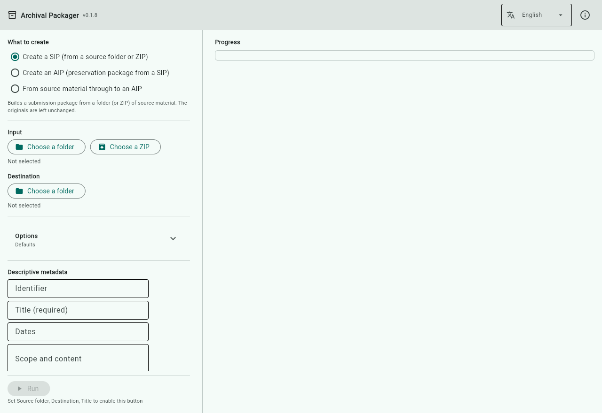

The window has two halves.

- **Left** — what to create, which folders to use, and so on. Fill it in from top to bottom
- **Right** — once you press **Run**, what the application is doing, and then the result

### The top bar

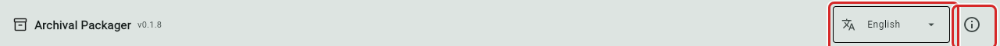

- The number next to the name at the left, such as **v0.1.8**, is the **version**. Please include it when you get in touch
- The menu showing **English** switches the interface language. The choice is remembered.
  Switching clears anything you have entered, so choose the language before you start
- The **ⓘ** at the right opens a short guide, the licences and contact details ([section 7](#7-how-to-use-licences-and-contact))

---

## 2. Building a submission package (SIP)

A SIP (Submission Information Package) gathers the files you received **exactly as they are**,
together with a record of when, what and how many were received.

### What to create

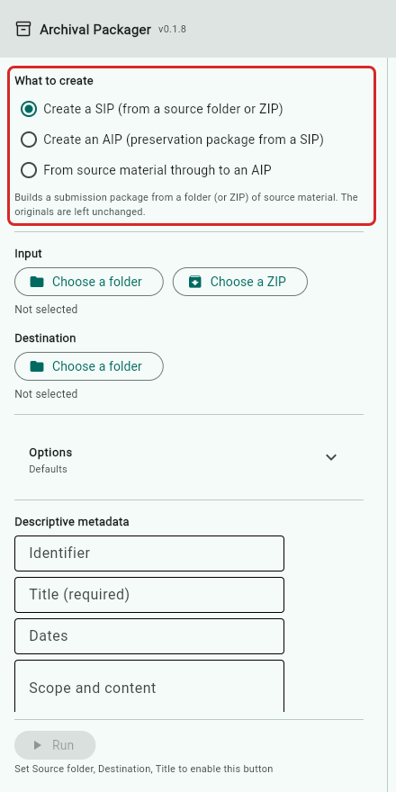

Choose one of three. A line underneath says what the chosen one does.

| Choice | What it does |
| --- | --- |
| Create a SIP | Builds a submission package from a folder (or ZIP) of source material |
| Create an AIP | Builds a preservation package from an existing SIP ([section 4](#4-building-a-preservation-package-aip)) |
| From source material through to an AIP | Does both, one after the other ([section 6](#6-from-source-material-to-an-aip-in-one-go)) |

Usually you choose **Create a SIP**, check what is in it, and only then go on to the AIP.

### When Run cannot be pressed

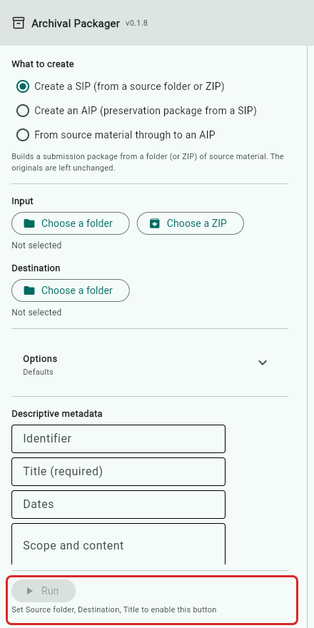

**Run** stays grey until everything it needs has been given.
The line underneath says **what is still missing**.
In this picture, the source folder, the destination and the title are missing.

### Input and destination

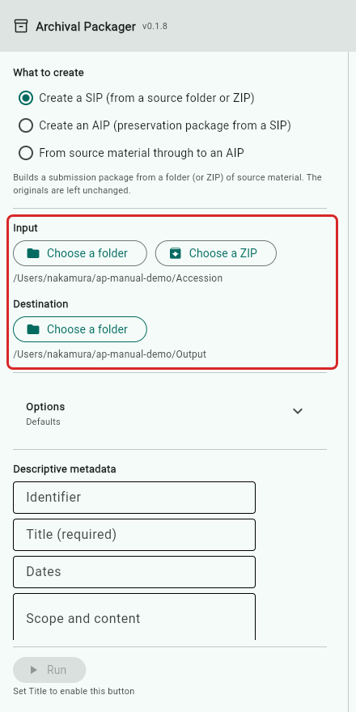

1. Under **Input**, press **Choose a folder** and choose the folder of files you received.
   If they arrived as a ZIP file, use **Choose a ZIP** instead
2. Under **Destination**, press **Choose a folder** and choose where the package should be written

The chosen location appears under each button.

**Your original files are never changed.** The application only reads the input folder.
The package is written, as new files, into the destination.

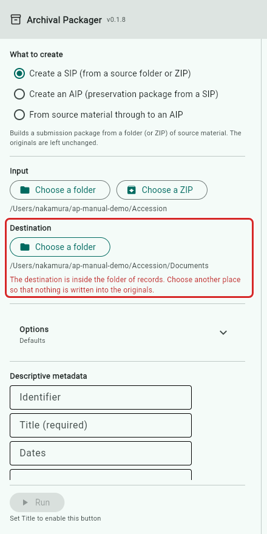

If you choose a destination **inside the source folder**, a red warning appears and Run cannot be pressed.
This keeps anything from being written into the originals. Choose another place.

### Descriptive metadata

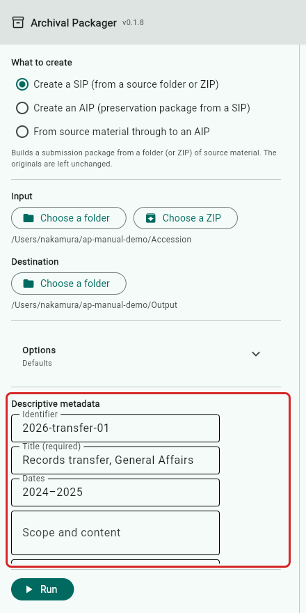

Enter information about the material. It is kept in the package as the accession record.

| Field | What to enter |
| --- | --- |
| Identifier | A name that tells this accession apart (for example `2026-transfer-01`). **It becomes the package's folder name** |
| Title (required) | A name for the body of material. **This is the only field you must fill in** |
| Dates | The period the material covers (for example `2024–2025`) |
| Scope and content | What the material is, and what it covers |
| Archivist | Who did the work. It is recorded in the AIP's preservation events as the person responsible |

**Archivist** and **Previous accession record** below it appear when you scroll down the left half.
The previous accession record is only for matching against an earlier accession; you can normally leave it empty.

### Options

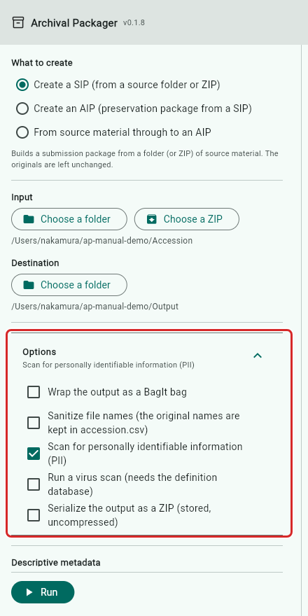

**Options** starts closed. Press it to open it.
Even while it is closed, the line under the heading shows **what is currently switched on** ("Defaults" if nothing is).

| Option | What changes |
| --- | --- |
| Wrap the output as a BagIt bag | Packs the SIP in BagIt, a layout commonly used for handing files over |
| Sanitize file names | Fixes characters that other computers struggle with, and names that are too long. The original names are kept on record |
| Scan for personally identifiable information (PII) | Looks for things like e-mail addresses and phone numbers. Anything found is listed in the result |
| Run a virus scan | Checks the files for viruses. It needs the definition database (next section) |
| Serialize the output as a ZIP | Puts the finished package into a single ZIP file, which is handy for handing it over |

### Virus definition database

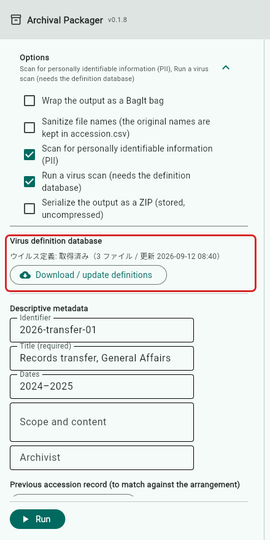

Ticking **Run a virus scan** shows the **Virus definition database** section.
This is the data used to recognise viruses; it is a few hundred MB.

- If it says the definitions have been downloaded, you can go ahead. The date is when they were last updated
- The first time, or if they have not been updated for a while, press **Download / update definitions**.
  This needs an internet connection

If you run without the definitions, the virus scan is recorded as "skipped" — never as "no problems".

### Run it, and read the result

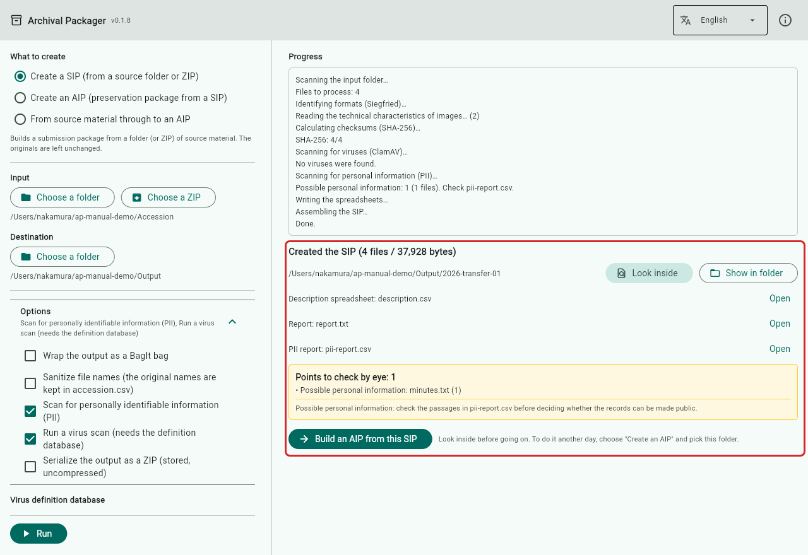

Press **Run**. The **Progress** box on the right shows what is being done.
When it finishes, **Created the SIP** appears, followed by:

- Where the package is. **Look inside** shows what is in it (next section).
  **Show in folder** opens the folder in Finder (File Explorer on Windows)
- Other files that were made, such as the description spreadsheet and the report. **Open** opens them in your usual application
- **Points to check by eye** (the yellow box): files a person should look at.
  In this picture the personal information scan has found something that looks like a phone number.
  The note at the bottom of the box says what to check
- The **Build an AIP from this SIP** button ([section 4](#4-building-a-preservation-package-aip))

When there is nothing to check, a green line says "There is nothing that needs checking by eye."

Four kinds of thing can appear among the points to check:

- files in which a virus was detected
- files that may contain personal information
- files whose format could not be identified
- files whose extension (such as `.pdf`) does not match what they actually contain

**The application never deletes or fixes any of these by itself.** What to do with them is a decision for a person.

---

## 3. Looking inside the SIP

**Look inside** replaces the window with a view of the package. Five tabs run along the top.
**Close** at the top right takes you back.

### Overview

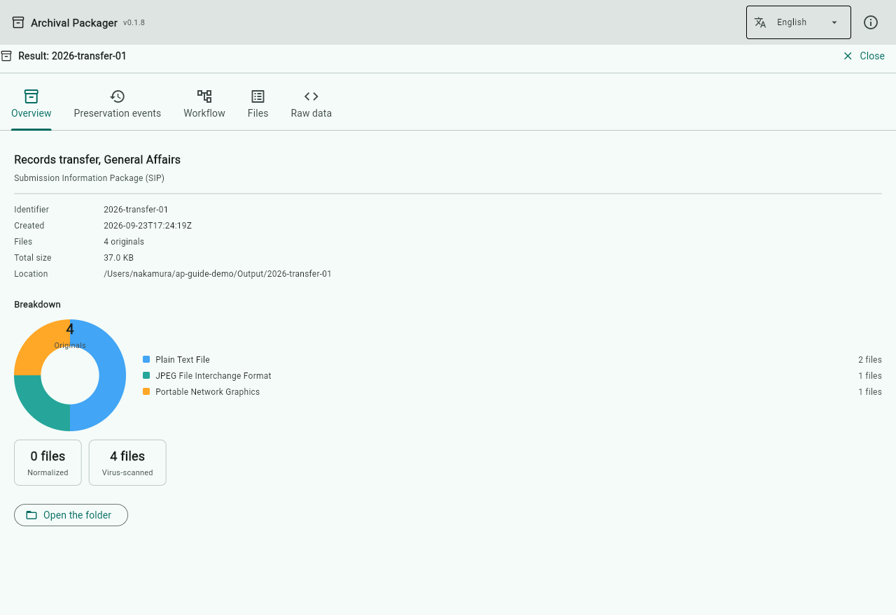

A summary of what is in the package: the title, identifier, when it was made, how many files and how large,
and a breakdown by file format (the ring chart).
**Open the folder** at the bottom opens the package folder.

### Preservation events (empty for a SIP)

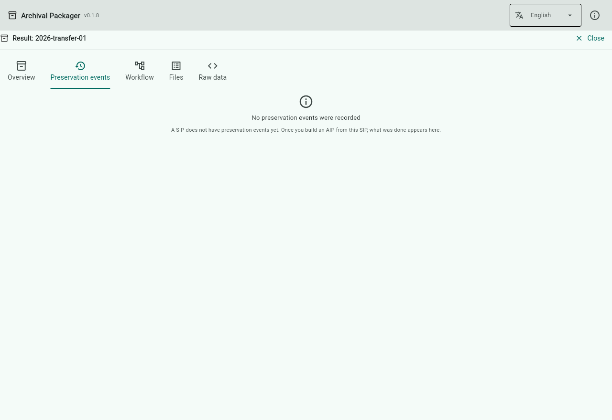

For a SIP, this tab says "No preservation events were recorded". **That is expected.**
Preservation events are written when the AIP is built ([section 5](#5-looking-inside-the-aip-and-the-workflow-tab)).
The **Workflow** tab shows the same message.

### Files

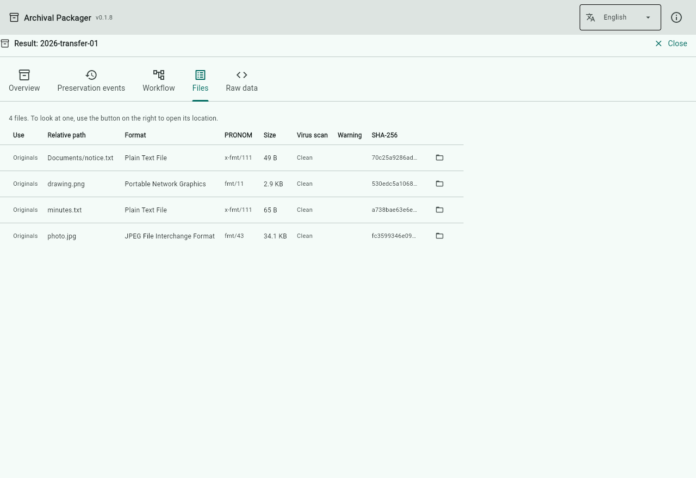

One line per file, with its format (for example Plain Text File), size, virus scan result and so on.
The button at the end of each line opens the folder the file is in.

**The originals have not been changed.** What is listed here are the copies inside the package.

### Raw data

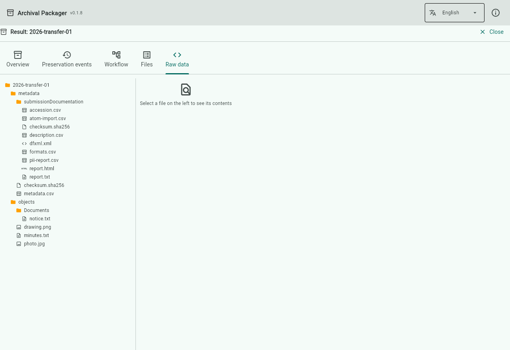

The package folder, shown as a tree. Choose a file on the left to see its contents on the right.
You will not usually need this; it is for looking at the record files themselves.

---

## 4. Building a preservation package (AIP)

An AIP (Archival Information Package) is the SIP **prepared for long-term preservation**.
For example, images also get a copy in a format suited to long-term keeping (TIFF).

### Straight after building the SIP

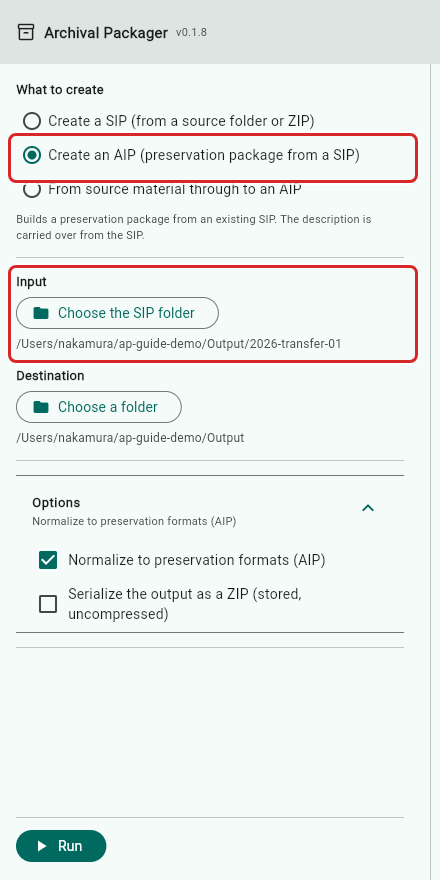

Press **Build an AIP from this SIP** under the SIP's result.
**What to create** switches to **Create an AIP**, and **Input** is set to the SIP you just made.

To build the AIP on another day, choose **Create an AIP** yourself and use
**Choose the SIP folder** under **Input**.
If you choose a folder that is not a SIP (such as the source folder), a red note tells you so.

The descriptive metadata fields are not shown when creating an AIP; what you entered for the SIP is carried over.

### Destination and options

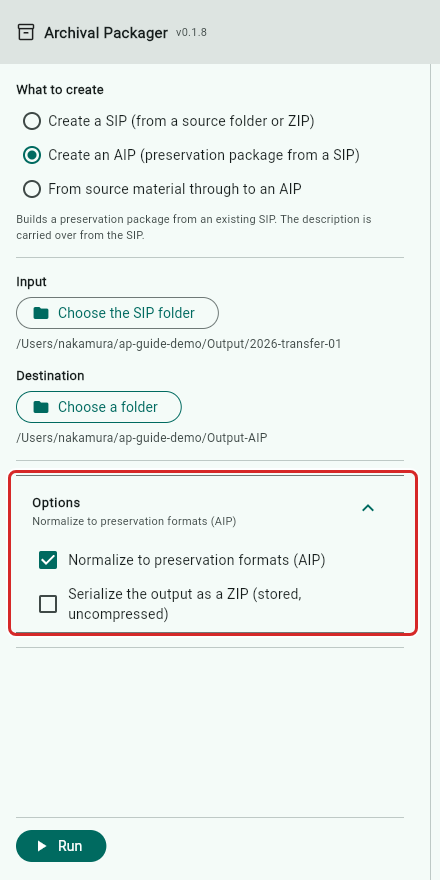

Choose a **Destination**. It can be the same place as the SIP, or somewhere else.

Two options apply to an AIP:

| Option | What changes |
| --- | --- |
| Normalize to preservation formats (AIP) | Adds TIFF copies of images and PDF copies of PostScript/EPS. **Ticked from the start** |
| Serialize the output as a ZIP | Puts the finished package into a single ZIP file |

**The originals go into the AIP as well.** Normalization only adds copies.

### Run it, and read the result

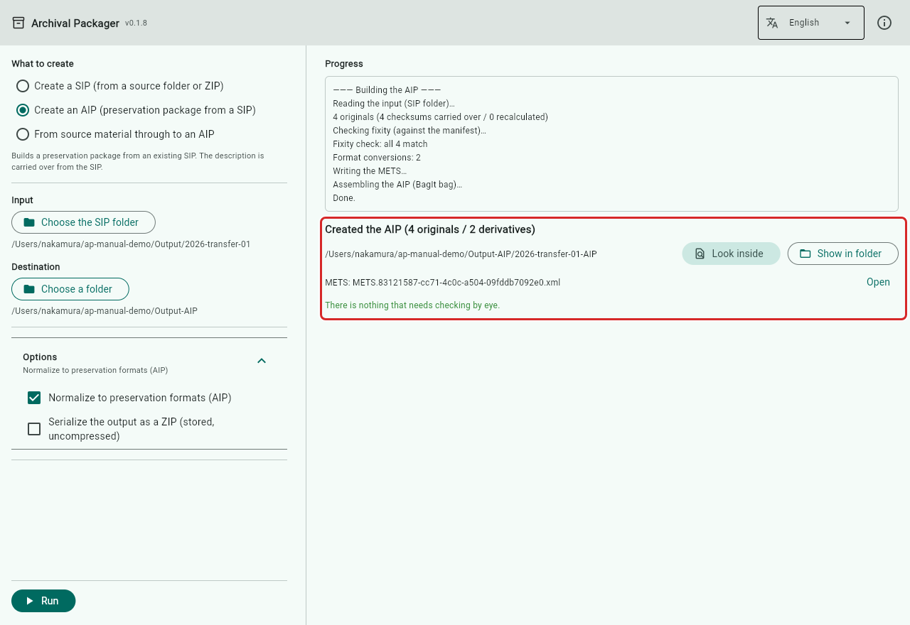

Press **Run**, and **Created the AIP** appears.
The numbers in brackets are how many original files there are, and how many copies (derivatives) normalization made.

While building the AIP, the application also checks that the SIP's files
**have not changed since they were received**.

---

## 5. Looking inside the AIP, and the Workflow tab

**Look inside** shows the same five tabs as for a SIP.
For an AIP, the Preservation events and Workflow tabs have content.

### Overview

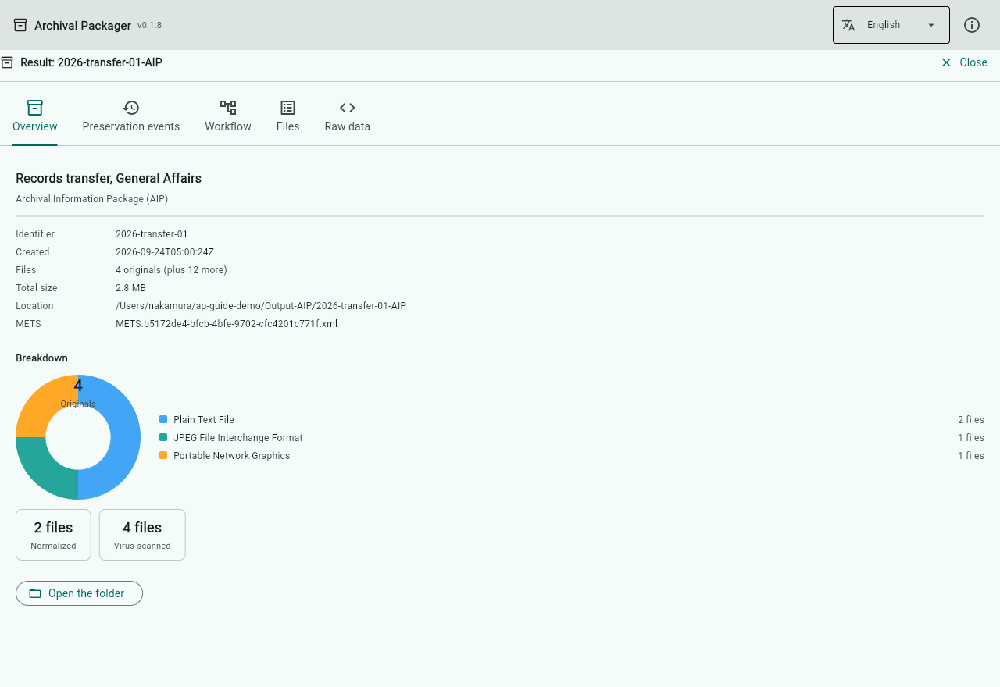

As for the SIP, plus the number of files that were normalized.

### Preservation events

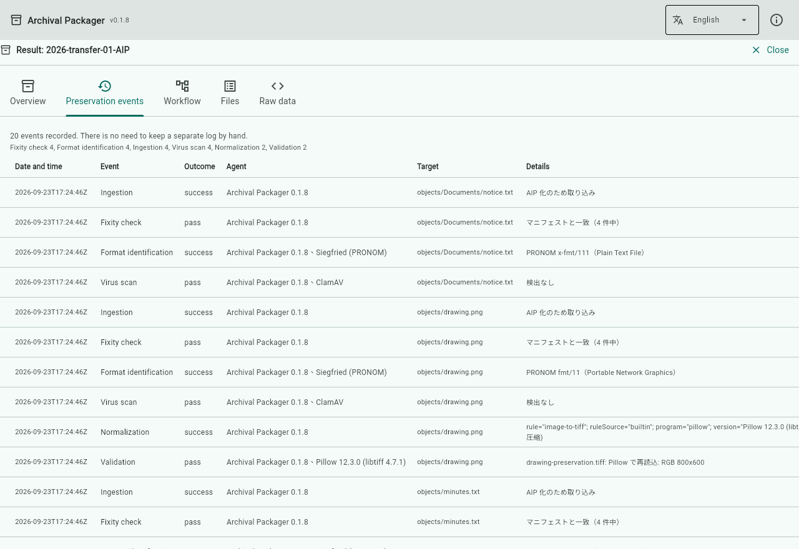

Every step taken while building the AIP, one per line:
when, what, with which tool, and with what outcome.
These records are saved inside the package, in **PREMIS**, the international standard for preservation records.

### Workflow

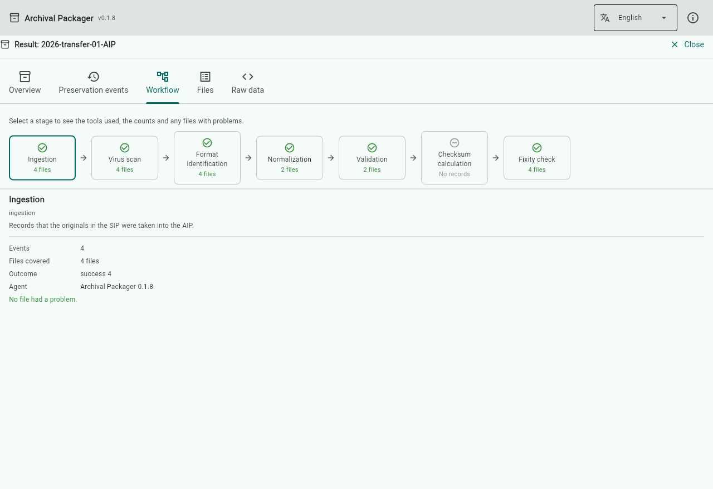

The same preservation events, **grouped by stage and drawn as a flow**, left to right in the order they happen:

Ingestion → Virus scan → Format identification → Normalization → Validation → Checksum calculation → Fixity check

The mark on each stage means:

- **Green tick** — there are records, and no problems
- **Orange warning** — some files had a problem. Press the stage to see which
- **Grey bar and "No records"** — nothing was recorded for this stage. Stages that did not run are shown this way rather than left out
  (for example, if you did not run a virus scan, that stage says "No records")

**Press a stage to see its details underneath:**
what the stage checks, how many records there are, how many files they cover, the outcome, and the tools used.

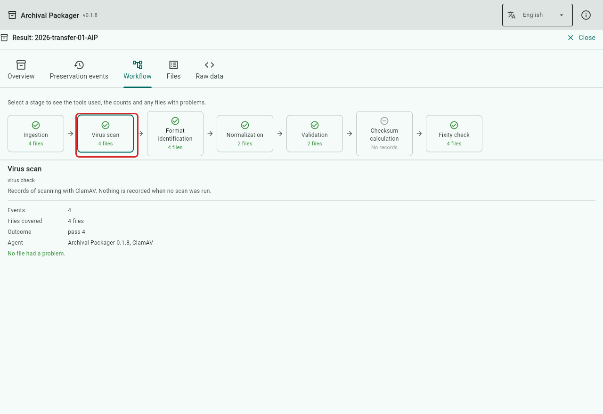

*After pressing Virus scan. All four files passed.*

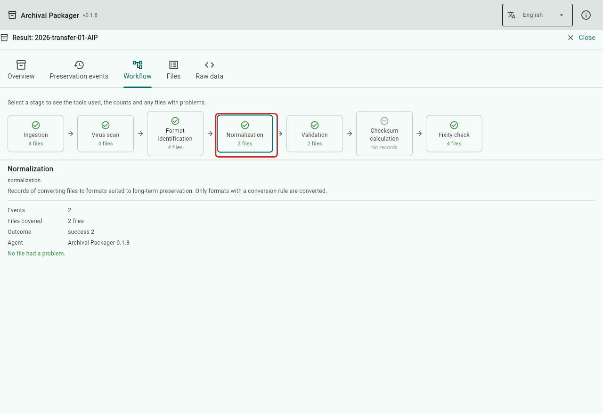

*After pressing Normalization. Only the two images have a normalization rule, so two files are covered.*

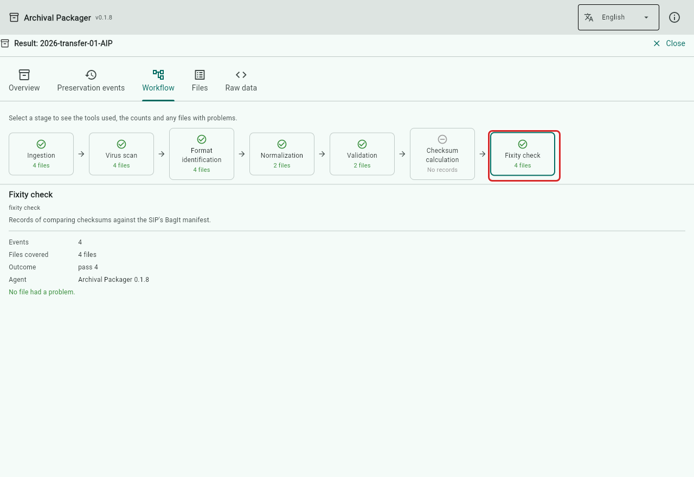

*After pressing Fixity check. This records that the SIP's files have not changed since they were received.*

**Checksum calculation** always says "No records". **That is expected.**
Checksums (the numbers used to tell whether a file has changed) are stored with each file's own information,
and are not written as a separate preservation event.

### Files

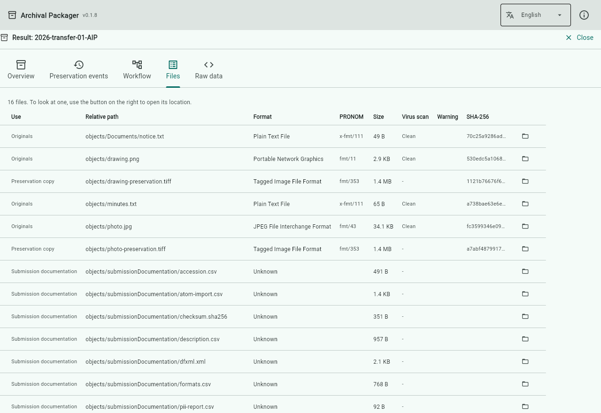

For an AIP, the list contains the originals (use "Originals"), the copies made by normalization
(use "Preservation copy"), and the record files (use "Submission documentation").

---

## 6. From source material to an AIP in one go

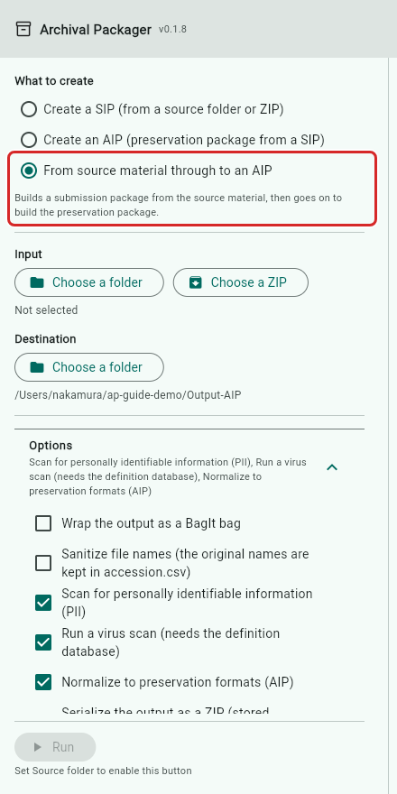

Choosing **From source material through to an AIP** builds the SIP and then carries straight on to the AIP.
The input is the source folder, and you enter the descriptive metadata as for a SIP.
The options for both the SIP and the AIP are listed.

Because there is no chance to check the SIP in between,
**we recommend creating the SIP and the AIP separately in normal use.**
This choice is for when you receive similar material repeatedly and already know what to check.

---

## 7. How to use, licences and contact

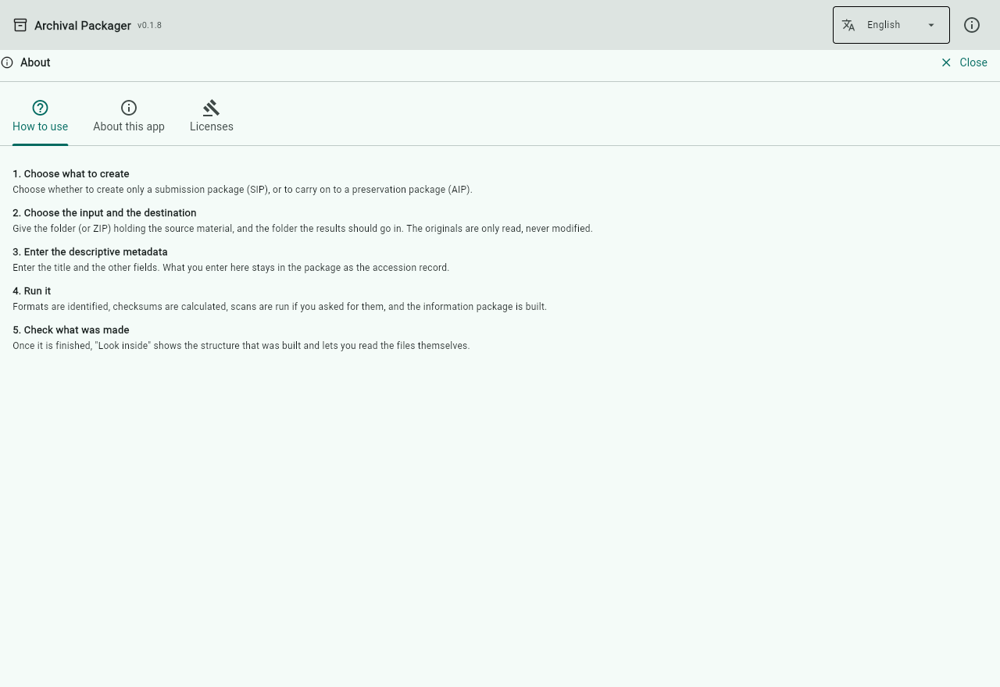

The **ⓘ** at the top right opens this view, with three tabs:

- **How to use** — a summary of the steps in the window
- **About this app** — what the application is, who made it, contact details, and the privacy policy
- **Licenses** — the licences of this application and of the tools it includes

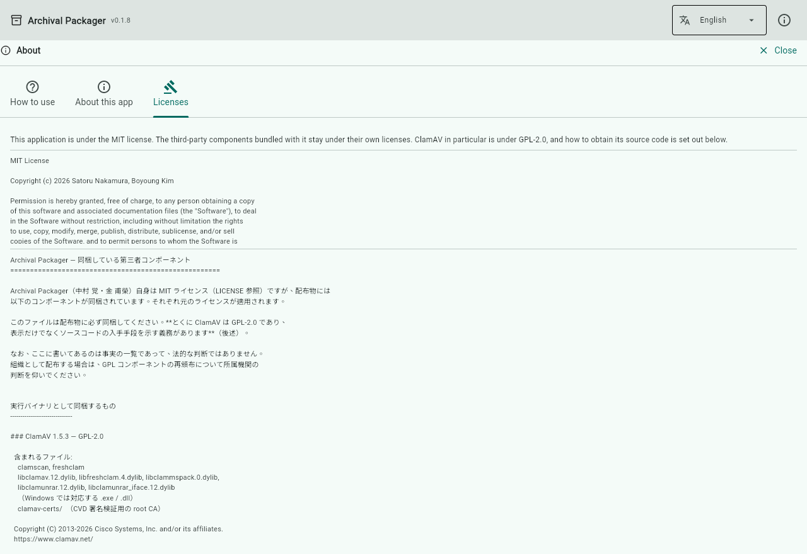

**Close** takes you back.

---

## If you are stuck

Common questions, and information for IT staff deciding whether to allow the application,
are in [Getting started](../guide/en.md#if-something-goes-wrong).

If you have a question, please write to nakamura@hi.u-tokyo.ac.jp.
It helps to include the version number (top left of the window) and whether you use Windows or a Mac.
