<!--
画面の使い方（日本語）。英語版は en.md。
読者は「はじめての方へ」（../guide/）と同じく、コンピュータの操作が専門ではない方。
ガイドが「動画で一通りやってみる」ページなのに対し、こちらは「画面のどこに
何があるか」を、写真を見ながら調べるページ。
画面写真は scripts/docs/capture_manual.py で撮り直せる。画面を変えたら撮り直すこと。
写真の名前（media/ja/<名前>.png）は、そのスクリプトの SHOTS と対応している。
コマンドラインと技術的な詳細は ../usage.md に分けている。ここには書かない。
-->

- 初めて使う方は、先に[はじめての方へ](../guide/)の動画をご覧ください。
  インストールから、パッケージを作るところまでを通して見られます
- コマンドで動かす方法や、出力されるファイルの細かい中身は、
  [使い方（詳細版）](../usage.md)にあります

写真は日本語の画面で、Mac で撮ったものです。Windows でも、窓の枠が違うだけで中身は同じです。

## 1. 画面の全体

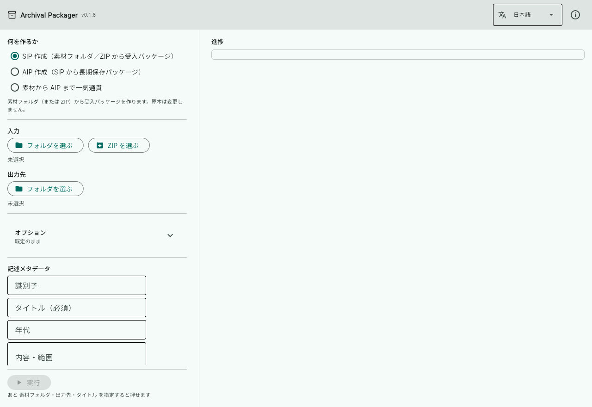

画面は左右に分かれています。

- **左側** — 何を作るか、どのフォルダを使うかなどを指定します。上から順に埋めていきます
- **右側** — 「実行」を押したあとの進み具合と、結果が出ます

### 上の帯

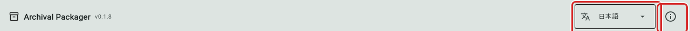

- 左端の **v0.1.8** のような数字は、アプリの**版の番号**です。お問い合わせのときに添えてください
- **「日本語」と書かれた所**を押すと、画面を英語に切り替えられます。
  一度選ぶと、次に開いたときも同じ言語になります。
  切り替えると、それまでに入れた内容は消えます。作業を始める前に選んでください
- 右端の **ⓘ** を押すと、使い方の要約・ライセンス・連絡先が出ます（[7 節](#7-使い方ライセンス連絡先)）

---

## 2. 受入パッケージ（SIP）を作る

SIP（受入パッケージ）は、受け入れた資料を、**そのままの形でまとめたもの**です。
いつ、何を、何件受け入れたかの記録が付きます。

### 何を作るか

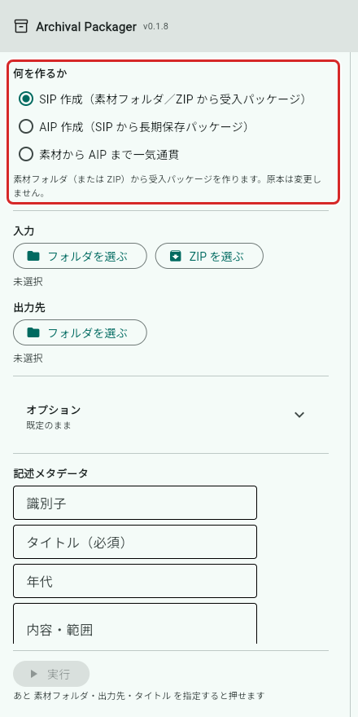

3 つから選びます。選ぶと、その下に何をするかが 1 行で出ます。

| 選択肢 | 何をするか |
| --- | --- |
| SIP 作成 | 資料のフォルダ（または ZIP）から、受入パッケージを作る |
| AIP 作成 | できている SIP から、長期保存パッケージを作る（[4 節](#4-長期保存パッケージaipを作る)） |
| 素材から AIP まで一気通貫 | 上の 2 つを続けて行う（[6 節](#6-素材から-aip-まで一度に作る)） |

ふだんは **「SIP 作成」**を選びます。SIP の中身を人の目で確かめてから、AIP に進むためです。

### 「実行」が押せないとき

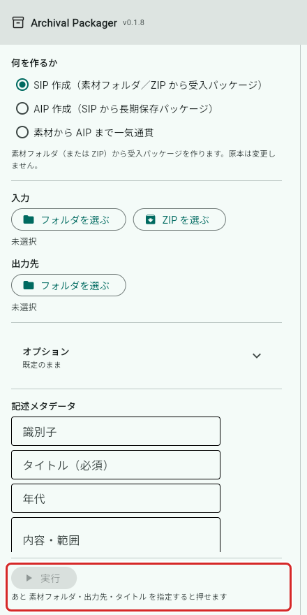

左下の「実行」は、必要なものがそろうまで押せません（灰色になっています）。
その下に、**あと何を指定すれば押せるか**が出ます。
この写真では「素材フォルダ・出力先・タイトル」が足りません。

### 入力と出力先

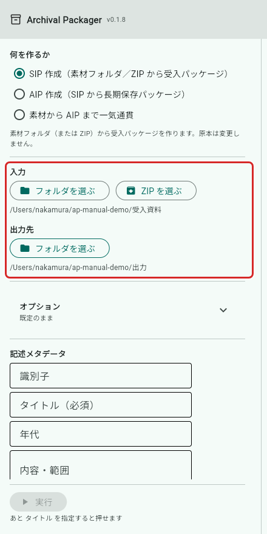

1. **「入力」の「フォルダを選ぶ」**を押し、受け入れた資料のフォルダを選びます。
   資料が ZIP で届いた場合は、「ZIP を選ぶ」を使います
2. **「出力先」の「フォルダを選ぶ」**を押し、パッケージを作る場所を選びます

選んだフォルダの場所が、ボタンの下に出ます。

**元の資料は変更されません。** アプリは入力のフォルダを読むだけです。
パッケージは、出力先に新しく作られます。

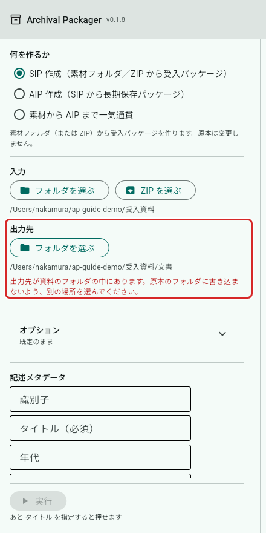

出力先に、**資料のフォルダの中**を選ぶと、赤字で注意が出て、実行できなくなります。
元の資料のフォルダに書き込まないためです。別の場所を選び直してください。

### 記述メタデータ

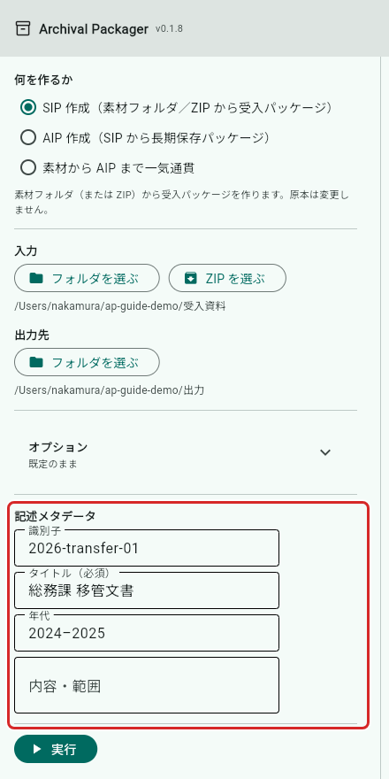

受け入れた資料についての情報を入れます。ここで入れた内容が、パッケージに記録として残ります。

| 欄 | 入れるもの |
| --- | --- |
| 識別子 | この受け入れを区別する名前（例: `2026-移管-総務課`）。**パッケージのフォルダ名**になります |
| タイトル（必須） | 資料のまとまりの名前。**これだけは必ず入れます** |
| 年代 | 資料の年代（例: `2024–2025`） |
| 内容・範囲 | どんな資料か、どこからどこまでか |
| 担当者名 | 作業をした人の名前。AIP の処理の記録に、作業者として残ります |

「担当者名」とその下の「前回の受入記録」は、左側を下にスクロールすると出てきます。
「前回の受入記録」は、以前に受け入れた記録と突き合わせるときだけ使います。ふだんは空のままでかまいません。

### オプション

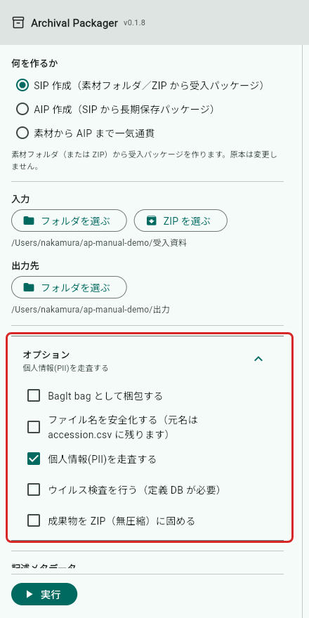

「オプション」は、最初は閉じています。押すと開きます。
閉じているときも、見出しのすぐ下に**いま選んでいるもの**が出ます（何も選んでいなければ「既定のまま」）。

| オプション | 選ぶと何が変わるか |
| --- | --- |
| BagIt bag として梱包する | 受け渡しでよく使われる決まった形（BagIt）にまとめます |
| ファイル名を安全化する | ほかのパソコンで扱いにくい文字や、長すぎる名前を直します。元の名前は記録に残ります |
| 個人情報(PII)を走査する | メールアドレスや電話番号などが書かれていないか探します。見つかったら結果に出ます |
| ウイルス検査を行う | ウイルスが入っていないか調べます。検査用のデータが要ります（次の項） |
| 成果物を ZIP（無圧縮）に固める | できたパッケージを ZIP にまとめます。人に渡すときに便利です |

### ウイルス定義データベース

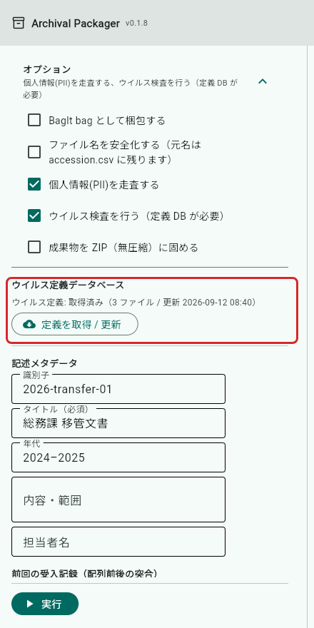

「ウイルス検査を行う」に印を付けると、その下に**「ウイルス定義データベース」**の欄が出ます。
ウイルスを見分けるためのデータで、数百 MB あります。

- 「取得済み」と出ていれば、そのまま使えます。日付は最後に更新した日です
- 初めて使うときや、しばらく更新していないときは、**「定義を取得 / 更新」**を押します。
  インターネットにつながっている必要があります

検査用のデータが無いまま実行すると、ウイルス検査は「スキップ」と記録されます。
「問題なし」とは記録しません。

### 実行して、結果を見る

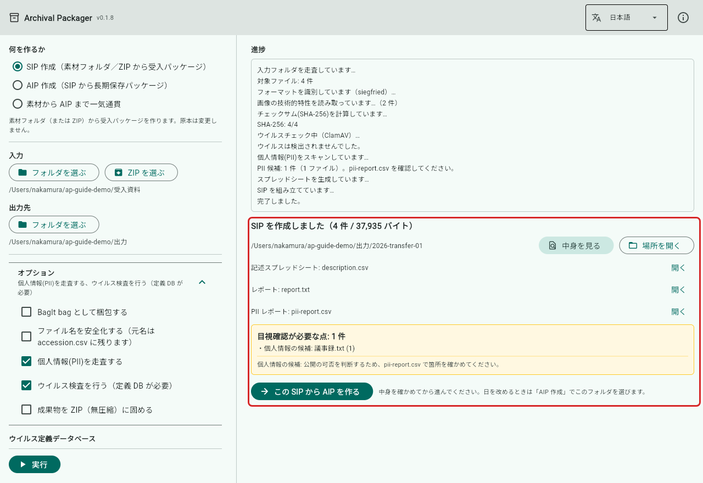

「実行」を押すと、右側の「進捗」に、いま何をしているかが流れます。
終わると、**「SIP を作成しました」**と出て、その下に次のものが並びます。

- できたパッケージの場所。**「中身を見る」**で中身を確かめられます（次の節）。
  **「場所を開く」**を押すと、Finder（Windows ではエクスプローラー）でそのフォルダが開きます
- 一緒にできたファイル（記述スプレッドシート、レポートなど）。「開く」で、いつものアプリで開きます
- **目視確認が必要な点**（黄色の囲み）。人が確かめたほうがよいファイルが並びます。
  この写真では、個人情報の走査で電話番号らしきものが 1 件見つかっています。
  囲みの下に、何を確かめればよいかが書いてあります
- **「この SIP から AIP を作る」**ボタン（[4 節](#4-長期保存パッケージaipを作る)）

確認が必要な点が無いときは、緑の字で「目視確認が必要な点はありません。」と出ます。

目視確認が必要な点に出るのは、次の 4 種類です。

- ウイルスが検出されたファイル
- 個人情報の候補が見つかったファイル
- 形式を特定できなかったファイル
- 拡張子（`.pdf` など）と、中身の形式が食い違っているファイル

**アプリは、どれも自動では消したり直したりしません。** 取り扱いは人が決めることだからです。

---

## 3. できた SIP の中身を見る

結果の「中身を見る」を押すと、画面がパッケージの中身の表示に切り替わります。
上にタブが 5 つ並びます。右上の**「閉じる」**で、元の画面に戻ります。

### 概要

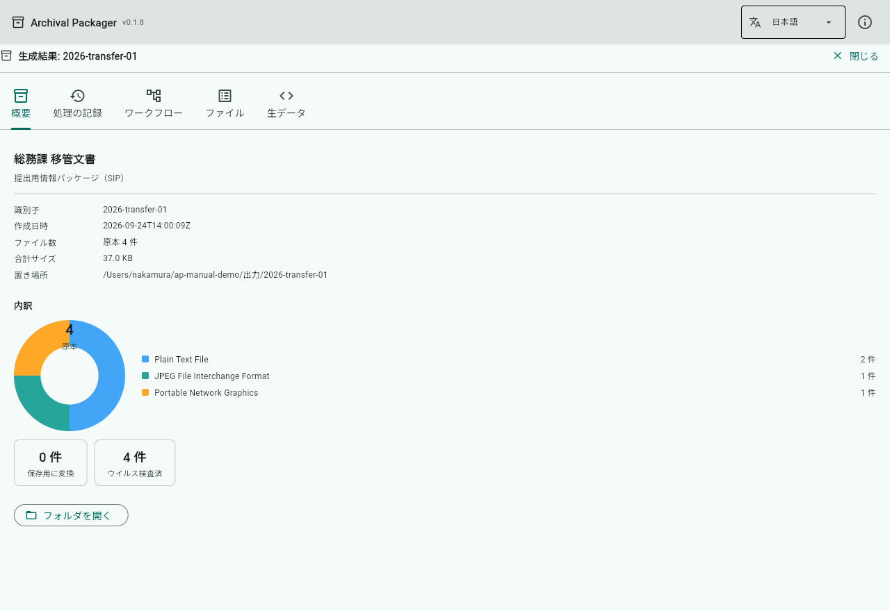

何がいくつ入っているかをまとめて見せます。
タイトル、識別子、作った日時、ファイルの数と合計の大きさ、ファイルの形式ごとの内訳（円グラフ）が出ます。
下の「フォルダを開く」で、パッケージのフォルダが開きます。

### 処理の記録（SIP の段階では空です）

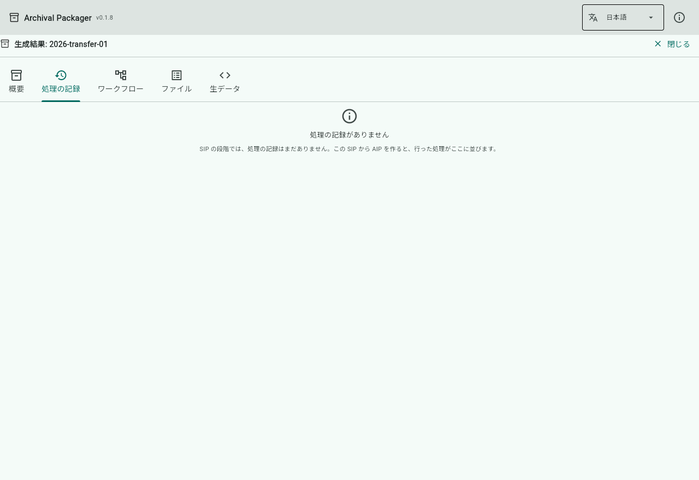

SIP の段階では、「処理の記録がありません」と出ます。**これで正常です。**
処理の記録は、AIP を作るときに書かれます（[5 節](#5-aip-の中身とワークフローを見る)）。
「ワークフロー」のタブも同じ表示になります。

### ファイル

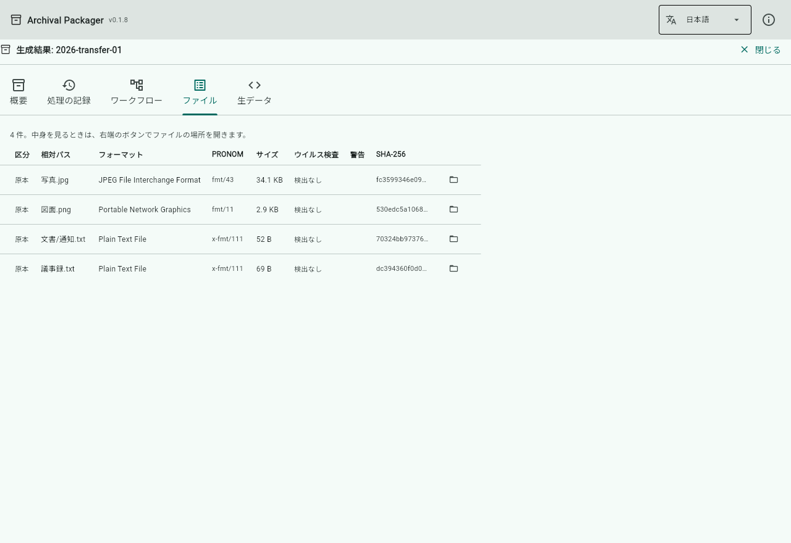

入っているファイルを 1 行ずつ並べます。
形式（例: JPEG File Interchange Format）、大きさ、ウイルス検査の結果などが見られます。
右端のボタンを押すと、そのファイルのある場所が開きます。

**元のファイルは変更されていません。** ここに並んでいるのは、パッケージの中に作った複製です。

### 生データ

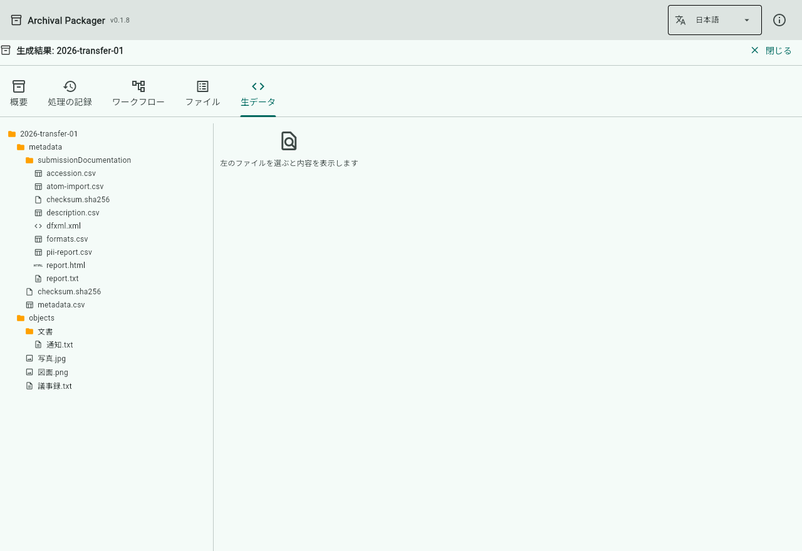

パッケージのフォルダの中身を、そのまま木の形で見せます。
左でファイルを選ぶと、右にその内容が出ます。
ふだんは使いません。記録のファイルそのものを確かめたいときに使います。

---

## 4. 長期保存パッケージ（AIP）を作る

AIP（長期保存パッケージ）は、SIP をもとに、**長く保存するための形に整えたもの**です。
たとえば画像は、長期保存に向いた形式（TIFF）の写しも作ります。

### SIP を作った直後なら

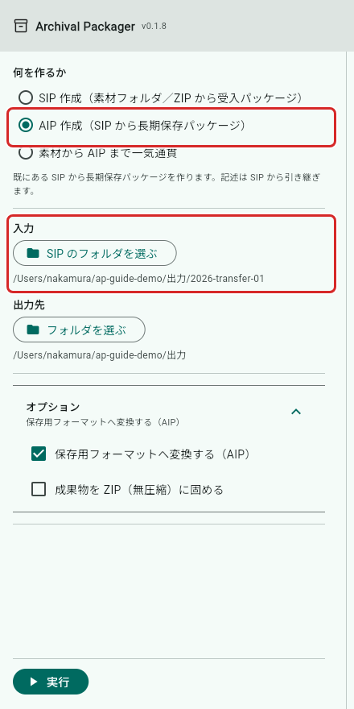

SIP の結果の下にある**「この SIP から AIP を作る」**を押します。
「何を作るか」が「AIP 作成」に切り替わり、「入力」には、いま作った SIP が入ります。

日を改めて AIP を作るときは、自分で「AIP 作成」を選び、
「入力」の**「SIP のフォルダを選ぶ」**で SIP のフォルダを選びます。
SIP ではないフォルダ（資料のフォルダなど）を選ぶと、赤字で知らせます。

記述メタデータの欄は、AIP 作成では出ません。SIP に入れた内容を、そのまま引き継ぐためです。

### 出力先とオプション

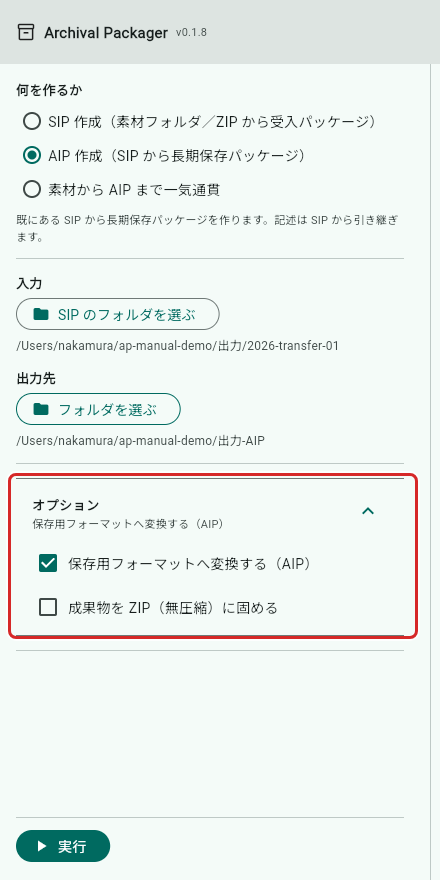

「出力先」を選びます。SIP と同じ場所でも、別の場所でもかまいません。

AIP 作成で選べるオプションは 2 つです。

| オプション | 選ぶと何が変わるか |
| --- | --- |
| 保存用フォーマットへ変換する（AIP） | 画像を TIFF に、PostScript／EPS を PDF にした写しを作ります。**最初から印が付いています** |
| 成果物を ZIP（無圧縮）に固める | できたパッケージを ZIP にまとめます |

変換しても、**元のファイルもそのまま AIP に入ります。** 写しが加わるだけです。

### 実行して、結果を見る

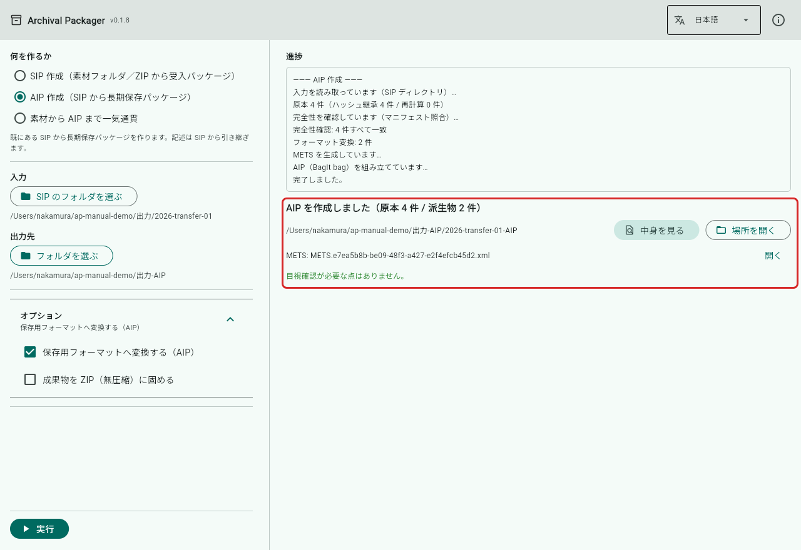

「実行」を押すと、**「AIP を作成しました」**と出ます。
かっこの中は、元のファイル（原本）の数と、変換で作った写し（派生物）の数です。

AIP を作るとき、アプリは SIP のファイルが**受け入れたときから変わっていないか**も確かめます。

---

## 5. AIP の中身とワークフローを見る

「中身を見る」を押すと、SIP と同じ 5 つのタブで中身が見られます。
AIP では、処理の記録とワークフローに中身が入ります。

### 概要

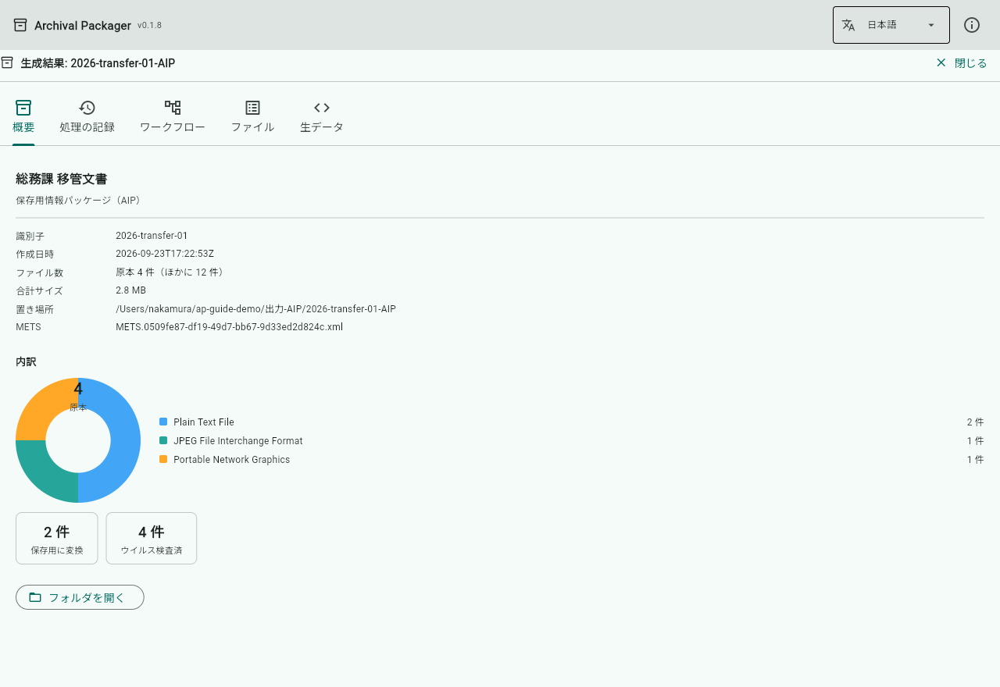

SIP の概要に加えて、「保存用に変換」の件数が出ます。

### 処理の記録

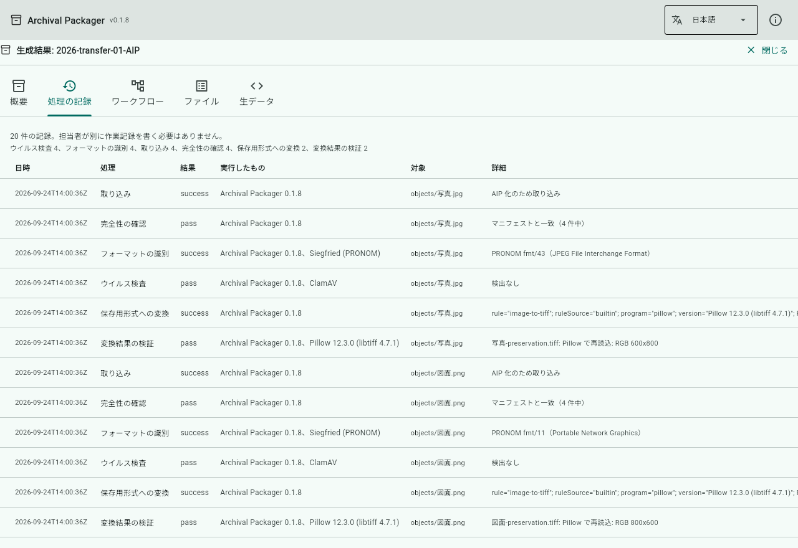

AIP を作るときに行った処理を、1 件 1 行で並べます。
いつ、何を、どの道具で行い、結果はどうだったかが分かります。
この記録は、パッケージの中に一緒に保存されます。
（保存の記録の国際的な決まりである **PREMIS** の形で書かれています。）

### ワークフロー

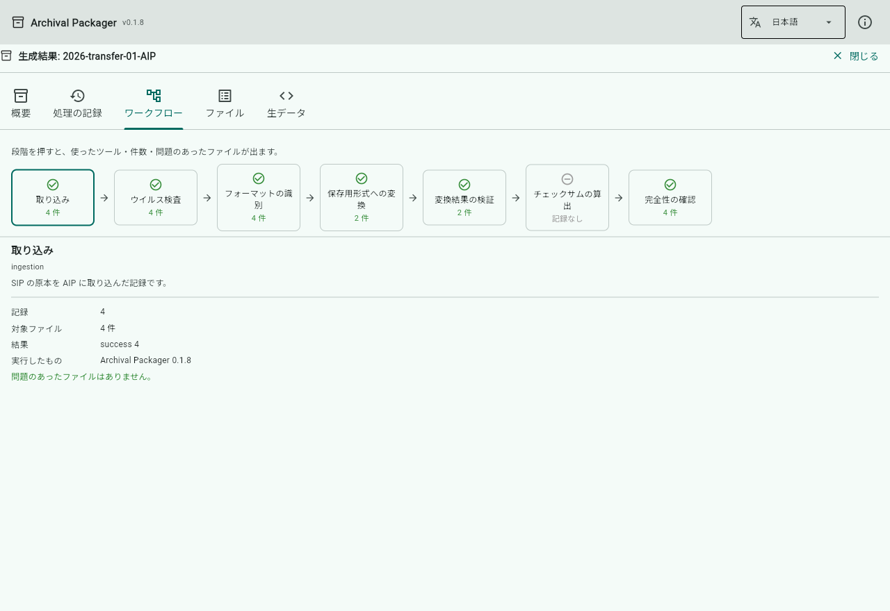

処理の記録を、**段階ごとにまとめて流れ図にしたもの**です。左から右へ、行った順に並びます。

取り込み → ウイルス検査 → フォーマットの識別 → 保存用形式への変換 → 変換結果の検証 → チェックサムの算出 → 完全性の確認

段階の中の印は、次の意味です。

- **緑のチェック** — 記録があり、問題はありませんでした
- **オレンジの注意** — 問題のあったファイルがあります。押して、どのファイルかを確かめてください
- **灰色の横棒と「記録なし」** — この段階の記録がありません。行わなかった段階も、消さずにこう表示します
  （たとえばウイルス検査をしなかったときは、ここが「記録なし」になります）

**段階を押すと、その下に詳しい内容が出ます。**
何を確かめた段階か、記録の件数、対象のファイルの数、結果、使った道具が分かります。

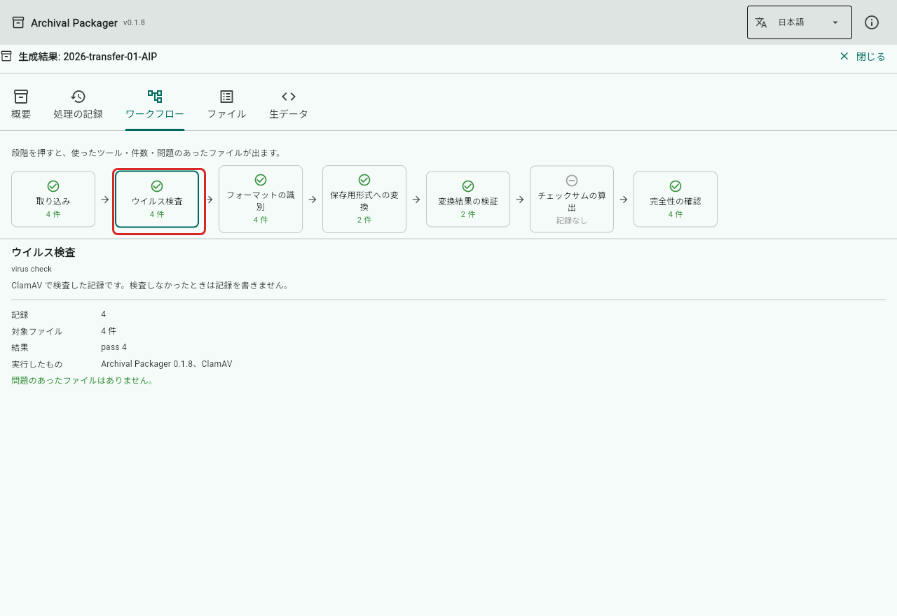

*「ウイルス検査」を押したところ。4 件とも検査を通っています。*

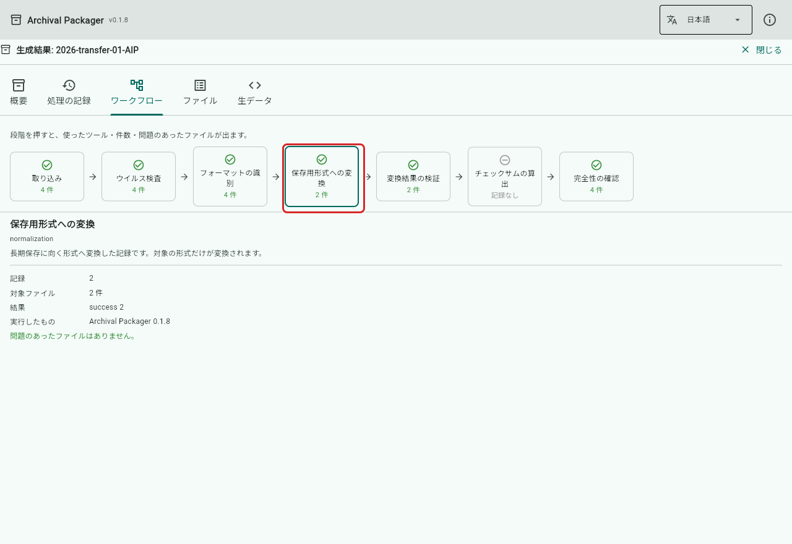

*「保存用形式への変換」を押したところ。変換の対象は画像 2 件だけなので、対象ファイルは 2 件です。*

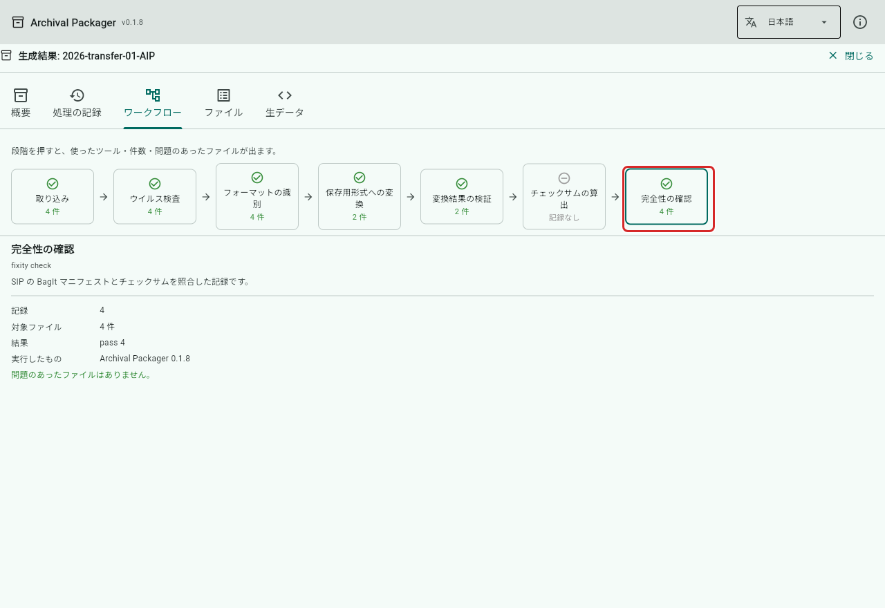

*「完全性の確認」を押したところ。SIP のファイルが、受け入れたときから変わっていないことを確かめた記録です。*

「チェックサムの算出」は、いつも「記録なし」と出ます。**これで正常です。**
チェックサム（ファイルが変わっていないかを確かめるための数値）は各ファイルの情報に入っていて、
処理の記録としては書いていないためです。

### ファイル

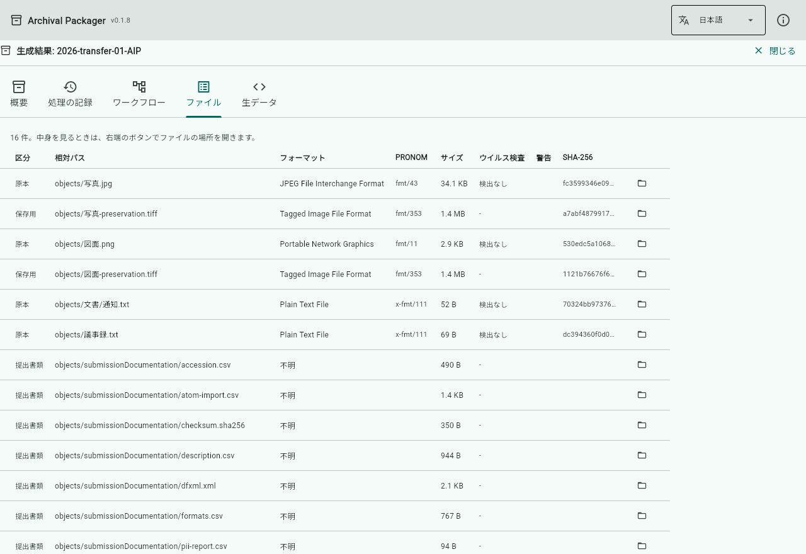

AIP では、元のファイル（区分「原本」）と、変換で作った写し（区分「保存用」）が並びます。
記録用のファイル（区分「提出書類」）も入ります。

---

## 6. 素材から AIP まで一度に作る

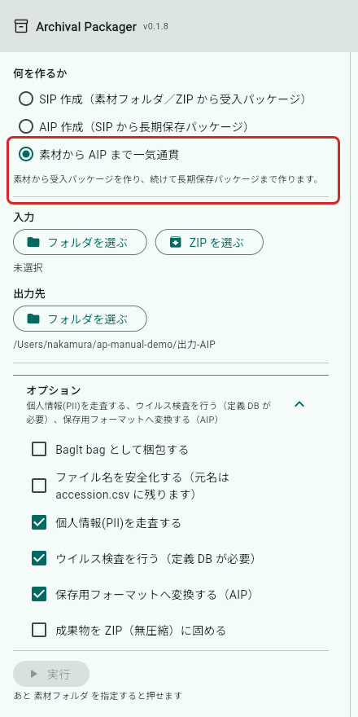

「何を作るか」で**「素材から AIP まで一気通貫」**を選ぶと、SIP を作り、続けて AIP まで作ります。
入力は資料のフォルダ、記述メタデータも SIP 作成と同じように入れます。
オプションは、SIP 用と AIP 用の両方が並びます。

途中で SIP の中身を確かめる機会がないので、**ふだんは SIP 作成と AIP 作成を分けて行うことをお勧めします。**
同じような資料を何度も受け入れていて、確かめる点が分かっているときに使ってください。

---

## 7. 使い方・ライセンス・連絡先

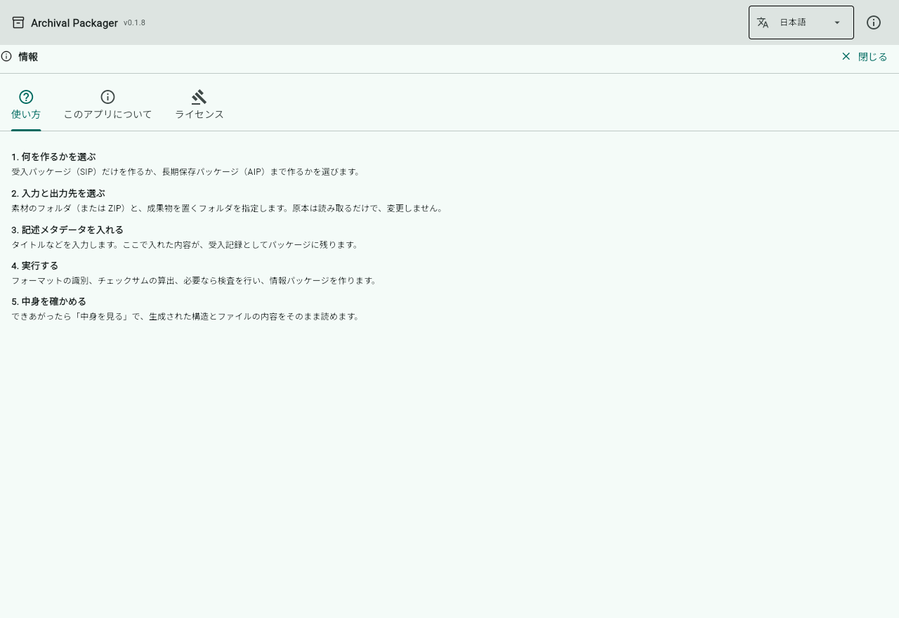

右上の **ⓘ** を押すと、この画面になります。タブが 3 つあります。

- **使い方** — 画面での手順の要約
- **このアプリについて** — アプリの説明、開発者、連絡先、プライバシーポリシー
- **ライセンス** — このアプリと、中で使っている道具のライセンス

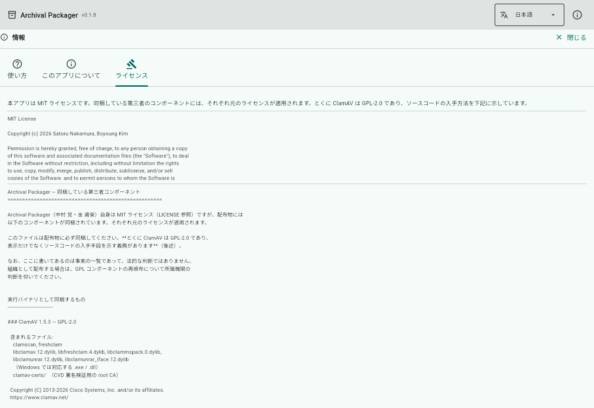

「閉じる」で元の画面に戻ります。

---

## 困ったときは

よくある質問と、職場のパソコンに入れるときの情報は、[はじめての方へ](../guide/#困ったときは)にまとめています。

分からないことがあれば、nakamura@hi.u-tokyo.ac.jp までお問い合わせください。
版の番号（画面左上）と、使っているパソコン（Windows / Mac）を添えていただけると助かります。
