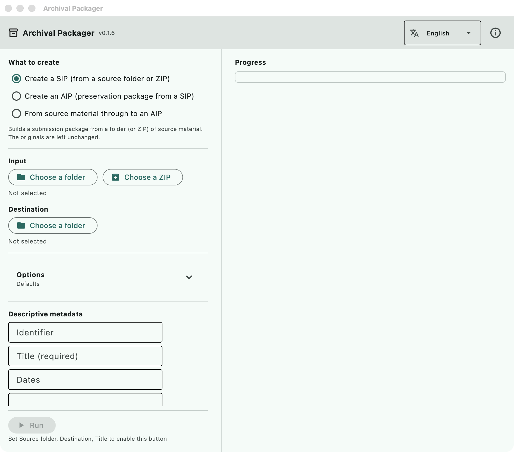

This is the operator's manual: how to install the application, how to use it
from its window, and how to use it from the command line.

**Read [Known limits](../README.md#known-limits) before you rely on it.**

### The command line is for people running from source

Arguments do not reach the packaged builds (the Microsoft Store version and the
`.dmg` version) — they arrive as `argv=['']`. This is a limit of the way Flet
packages the application, and it cannot be fixed on our side. **If you installed
the application, read only "Using the window".**

The command line works when you clone the repository and run it with `uv`.

---

## Installing and the first launch

| Platform | Where | Notes |
| --- | --- | --- |
| Windows 10/11 | [Microsoft Store](https://apps.microsoft.com/detail/9N6XJD7THHPZ) | Installs and updates like any other Store application |
| macOS 12+ | [Releases](https://github.com/nakamura196/archival-packager/releases/latest) | A signed and notarised `.dmg`. Drag the application into Applications |

Nothing else has to be installed. Siegfried (format identification) and ClamAV
(virus scanning) are bundled.

**The first launch takes a few minutes** and the window may appear to do
nothing. The Python runtime inside the application (about 100 MB) is being
unpacked. Later launches are quick.

macOS may say the application cannot be opened because the developer cannot be
verified. It is signed with a Developer ID and notarised by Apple, so this
normally does not happen; if it does, open it once from the right-click menu
("Open") rather than by double-clicking.

**The first thing to do**, if you will use the virus scan, is to download the
definition database (several hundred megabytes). Use "Download / update
definitions" under "Virus definition database". See
[below](#the-virus-definition-database) for details.

### Switching the interface to English

The window opens in the language your operating system is set to. Japanese
for a Japanese system, **English for everything else** — German, Korean and
so on get English rather than Japanese, because the source language of the
code is not a reason to show someone a screen they cannot read.

The language selector is at the **top right of the window**, next to the
version number. It is placed in the header on purpose: someone who reads only
English should not have to find it inside a Japanese screen. Once you choose
a language it is remembered, and it always beats the system setting — so an
English interface on a Japanese machine is a choice you can make and keep.

**The interface is translated. The packages are not.** Column headings in the
CSV files, the text of `report.txt`, and the PREMIS event records are written
in Japanese whatever the interface language is. This is deliberate: an
information package is meant to last decades, and `core/sip_reader.py` reads
those headings back. If the headings changed with the interface language, a SIP
made in English could not be read by an application set to Japanese, and the
other way round.

So a non-Japanese reader gets an English interface over packages whose
spreadsheets and reports are in Japanese. Translating the package contents is
open work — see [issue #11](https://github.com/nakamura196/archival-packager/issues/11).

---

## Using the window

[Using the window](manual/en.md) goes through every part of the window with screenshots.
This section is the short version.



*The window as it opens (macOS, v0.1.6). Windows looks the same apart from the
window frame.*

### 1. Choose what to create

Three choices at the top:

| Choice | What it does |
| --- | --- |
| Create a SIP | Builds a **submission package** from a folder (or ZIP) of source material |
| Create an AIP | Builds a **preservation package** from a SIP that already exists |
| From source material through to an AIP | Does both, one after the other |

Normally you accession with "Create a SIP", check what it found, and only then
go on to the AIP. They are separate steps because **there are things a person
has to look at while the material is still a SIP**: personal information
candidates, files whose extension disagrees with their content, and files whose
format could not be identified.

### 2. Choose the input and the destination

- **Input** — the folder holding the material to accession. A ZIP can be given instead.
- **Destination** — where the package is written. Keep it outside the input folder
  (if you choose the input folder or a folder inside it, a red message says so and
  "Run" stays disabled).

The input folder is **only read**. Nothing is ever written into it.

### 3. Choose the options

"Options" is collapsed when the window opens, and the line under it says which
options are on ("Defaults" when none are).

| Option | What changes |
| --- | --- |
| Wrap the output as a BagIt bag | Writes the SIP as a BagIt bag (`bagit.txt` and `manifest-sha256.txt`) |
| Scan for personally identifiable information (PII) | Looks for email addresses, phone numbers, Japanese individual numbers, card numbers and Japanese postal codes, and lists candidates in `pii-report.csv` |
| Run a virus scan | Scans with the bundled ClamAV. **The definition database has to be downloaded first** ([below](#the-virus-definition-database)) |
| Sanitize file names | Repairs characters that cannot be used and names that are too long. The original names are kept in `accession.csv` |
| Serialize the output as a ZIP | Packs the finished package into an uncompressed ZIP, for handing over |
| Normalize to preservation formats (AIP) | Converts images to TIFF and PostScript/EPS to PDF while building the AIP |

The PII scan recognises **five categories, all defined around Japanese
conventions** — Japanese individual numbers (マイナンバー) and Japanese postal
codes in particular. Email addresses and card numbers are not
Japan-specific; phone numbers assume Japanese digit counts. Measured precision
and recall are in [docs/pii-accuracy.md](pii-accuracy.md).

### 4. Enter the descriptive metadata

- **Identifier** — the identifier of the transfer (e.g. `2026-transfer-general-affairs`). It becomes the folder name.
- **Title** — required. The name of the body of material.

"Dates", "Scope and content" and "Archivist" are optional. The archivist's name
is recorded in the AIP's PREMIS events as the agent that performed the work.

What you enter here is written into the package as the accession record.

### 5. Run it, and read what it says

"Run" shows progress, then the location of the finished package and a list
headed **"Points to check by eye"**. Four kinds appear there:

- `ウイルス検出:` — a file the virus scanner flagged, with the signature name
- `PII候補:` — a file holding something that looks like personal information, and how many
- `未識別:` — a file whose format could not be identified
- `拡張子不一致:` — a file whose extension disagrees with its actual format

These lines keep their Japanese prefixes, for the reason given above: they come
from `core/`, which does not go through the translation table.

**None of these are acted on automatically.** What to do about them is a
person's decision.

### 6. Look inside

"Look inside" shows the package as tables. What you can see **only here** is
the content of the METS and the PREMIS records — the XML is not readable as it
stands.

1. **Overview** — what is in it, how many, when it was made
2. **Preservation events** — when, what, with which tool, and with what outcome
3. **Workflow** — the same events grouped by stage (ingestion → virus scan →
   format identification → normalization → validation → checksum → fixity
   check). Select a stage to see the tools used, the counts and any files with
   problems. A stage with no records is shown as such, not hidden
4. **Files** — format, PRONOM identifier, size, SHA-256, virus scan result

The originals themselves (a PDF, a Word file) do not open in the application.
Open the folder and use whatever you normally use.

### 7. Build the AIP

Once the SIP has been checked, switch to "Create an AIP" and give it **the SIP
folder** as the input. Right after creating a SIP, "Build an AIP from this SIP"
under the result does both in one step. If you choose a folder that is not a
SIP (the source folder, or the destination folder that holds the SIP), a red
message under the input says so.

Building an AIP does three things:

- compares the SIP's manifest against the files on disk, to confirm nothing has changed since accession
- normalizes to preservation formats, if you asked for it
- writes a METS with PREMIS events embedded, and wraps the whole thing as a BagIt bag

Derivatives produced by normalization are **opened again and read back** —
a TIFF is fully decoded with Pillow, a PDF is re-opened with pypdf and must
report at least one page. A derivative that cannot be read back is discarded,
and the event is recorded as a failure. This is not format validation: opening
a file says nothing about whether it conforms to its specification.

---

## Using the command line

### Setting up

```sh
git clone https://github.com/nakamura196/archival-packager.git
cd archival-packager
uv sync
uv run archival-packager check
```

`check` reports the state of the bundled tools (format identification and virus
scanning), the virus definitions and the normalization rules. **It is there to
find out first what is unavailable**, so a missing tool does not make it fail.

The bundled tools are not in the repository. Fetch them if you need them
(`scripts/fetch-binaries.zsh` on macOS, `scripts/fetch-binaries.ps1` on Windows).
Without them, format identification and virus scanning are **skipped, not run**,
and the report says so — so that "not checked" never turns into "no problems".

### Commands

```
archival-packager sip --input DIR --output DIR --identifier ID --title TITLE
                      [--scope-note TEXT] [--date-note TEXT]
                      [--bag] [--scan-pii] [--virus-scan]
                      [--sanitize-filenames] [--zip] [--prior-accession CSV]
                      [--json] [--quiet]

archival-packager aip --sip DIR --output DIR
                      [--no-normalize] [--archivist NAME] [--zip]
                      [--json] [--quiet]

archival-packager inspect PACKAGE_DIR [--json]

archival-packager check [--json]
```

There is no command for the window's "From source material through to an AIP".
Call `sip`, then `aip` (they are kept apart so that a person can check the SIP
in between).

#### `sip` — build a submission package

| Option | Meaning |
| --- | --- |
| `--input DIR` | The source folder, or a ZIP file |
| `--output DIR` | Where to write. Created if missing (one level only) |
| `--identifier ID` | The identifier of the transfer. It becomes the package folder name |
| `--title TITLE` | Title (required) |
| `--scope-note` / `--date-note` | Scope and content / dates (optional) |
| `--bag` | Wrap the SIP as a BagIt bag |
| `--scan-pii` | Scan for personal information candidates |
| `--virus-scan` | Run a virus scan (needs the definition database) |
| `--sanitize-filenames` | Sanitize file names (the originals are kept in `accession.csv`) |
| `--zip` | Pack the finished SIP into an uncompressed ZIP |
| `--prior-accession CSV` | The previous `accession.csv`. Writes a map of the arrangement before and after |

```sh
uv run archival-packager sip --input ./incoming/2026-03 --output ./packages --identifier 2026-transfer-general-affairs --title "General affairs records" --scan-pii
```

#### `aip` — build a preservation package

| Option | Meaning |
| --- | --- |
| `--sip DIR` | The input SIP (a bag is fine) |
| `--output DIR` | Where to write |
| `--no-normalize` | Do not normalize to preservation formats |
| `--archivist NAME` | The archivist's name. Recorded in PREMIS as the agent |
| `--zip` | Pack the finished AIP into an uncompressed ZIP |

```sh
uv run archival-packager aip --sip ./packages/2026-transfer-general-affairs --output ./preservation --archivist "Satoru Nakamura"
```

#### `inspect` — show what is inside

Prints, as text, what the window's "Look inside" shows. With `--json` it lists
every file (the text output stops after the first 20).

```sh
uv run archival-packager inspect ./preservation/2026-transfer-general-affairs-AIP
uv run archival-packager inspect ./preservation/2026-transfer-general-affairs-AIP --json | jq '.summary'
```

### What the output promises (the part that matters for automation)

- **Progress goes to standard error, results to standard output**
- With `--json`, standard output is **a single JSON document**. Pipe it straight into `jq`
- `--quiet` stops the progress lines. **It does not stop the results or the findings**
- On failure, `--json` still returns `{"status": "error", "message": "..."}`

Exit codes:

| Code | Meaning |
| --- | --- |
| 0 | Success |
| 1 | The run failed (the input was not a SIP, the output could not be written, and so on) |
| 2 | Wrong arguments (missing, misspelt, or a path that does not exist) |

**A virus detection or a personal information candidate leaves the code at 0.**
A finding is material for a person to judge; the run itself succeeded. If it
counted as a failure, a nightly job could not tell "a failure to stop on" from
"a finding to look at". So that findings are not missed, they are always written
to standard error and to `findings` in the `--json` output.

**A fixity mismatch while building an AIP (the manifest check) also leaves the
code at 0.** The AIP is built and the mismatch is recorded in PREMIS. To catch
it in automation, read `.fixity.outcome` from the `--json` output (`passed` /
`failed` / `skipped`).

### Automation examples

#### Build a SIP from a watched folder every night (cron + zsh)

Anything longer than a few lines goes in a script rather than being pasted
into a terminal (pasting mangles line continuations). An example to save as
`scripts/nightly-sip.zsh`:

```zsh
#!/usr/bin/env zsh
# If today's material has arrived in the inbox, build a SIP. Called nightly from cron.
# Usage: nightly-sip.zsh
# Requires: the repository cloned and `uv sync` run.
set -euo pipefail

REPO=$HOME/archival-packager
INBOX=/Volumes/transfer/incoming
OUTBOX=/Volumes/transfer/packages
TODAY=$(date +%Y-%m-%d)

if [[ ! -d $INBOX/$TODAY ]]; then print "Nothing received: $TODAY"; exit 0; fi

cd $REPO
uv run archival-packager sip --input $INBOX/$TODAY --output $OUTBOX --identifier $TODAY --title "Daily accession $TODAY" --scan-pii --virus-scan --bag --json --quiet > $OUTBOX/$TODAY.json

print "SIP: $(python3 -c 'import json,sys; print(json.load(open(sys.argv[1]))["sip_path"])' $OUTBOX/$TODAY.json)"
```

The crontab entry (every night at 2 a.m.):

```
0 2 * * * /Users/archivist/archival-packager/scripts/nightly-sip.zsh >> /var/log/archival-packager.log 2>&1
```

`2>&1` is there so that the progress goes into the log too. Remove `--quiet`
to get one log line per step.

To be told on the days something was found, read the JSON:

```zsh
VIRUS=$(python3 -c 'import json,sys; print(len(json.load(open(sys.argv[1]))["findings"]["virus"]))' $OUTBOX/$TODAY.json)
if [[ $VIRUS -gt 0 ]]; then print "Check: $VIRUS virus detection(s)"; fi
```

#### Watch for regressions in CI (GitHub Actions)

Build a SIP from a small sample and check that **the result has not changed**.

```yaml
- run: uv sync
- run: uv run archival-packager check
- run: mkdir -p sample && printf 'test\n' > sample/a.txt
- run: uv run archival-packager sip --input sample --output ${{ runner.temp }}/out --identifier ci --title CI --json --quiet > ${{ runner.temp }}/sip.json
- run: uv run archival-packager inspect ${{ runner.temp }}/out/ci --json | jq -e '.overview.file_count == 1'
```

`sample` is a small folder that always gives the same result. Keep it in the
repository, or create it on the spot as above.

`jq -e` exits with 1 when the condition is false, so the job turns red on its
own. Values such as `.summary.unidentified` can be watched the same way, but
**in a CI without the bundled tools, format identification does not run and
every file is unidentified**. Choose what to watch according to what `check`
reports as available in that environment. Run `uv run pytest -q` as well (that
is what watches the application itself for regressions).

---

## What gets written

### SIP

```
<identifier>/
  objects/                      Copies of the originals (folder structure kept)
  metadata/
    metadata.csv                Archivematica-style description sheet (filled in by a person)
    checksum.sha256             SHA-256, paths relative to objects/
    submissionDocumentation/
      description.csv           AtoM / ISAD(G) description sheet (filled in by a person)
      atom-import.csv           For importing into AtoM (machine column names)
      formats.csv               Technical inventory (format, PRONOM, size, SHA-256, virus scan)
      accession.csv             Accession record (original file names and paths)
      dfxml.xml                 Technical metadata (DFXML)
      report.txt / report.html  Summary for people to read
      checksum.sha256           SHA-256, paths relative to the SIP root
      pii-report.csv            Personal information candidates (only with --scan-pii)
      arrangement-map.csv       Arrangement before and after (only with --prior-accession)
```

With `--bag`, all of the above goes under `data/`, and `bagit.txt` and
`manifest-sha256.txt` are added.

**The two files a person fills in are `description.csv` and `metadata.csv`.**
What is written in `metadata.csv` goes into the METS as file-level description
when the AIP is built.

The column headings of these CSV files and the text of the reports are in
Japanese, whatever the interface language (see
[Switching the interface to English](#switching-the-interface-to-english)).

### AIP

```
<identifier>-AIP/
  bagit.txt / bag-info.txt / manifest-sha256.txt / tagmanifest-sha256.txt
  data/
    METS.<uuid>.xml             METS with PREMIS embedded (the processing record)
    objects/                    The originals, plus preservation derivatives if normalized
    objects/submissionDocumentation/
                                The SIP's submission documents, and the normalization rules actually applied
    logs/                       Logs of the preservation processing
```

Read the METS with `inspect`, or with "Look inside" in the window.

### Image properties in `dfxml.xml`

For image files, an `ap:image` element is added to the DFXML `fileobject`,
recording **pixel dimensions, colour space, bits per sample and DPI**. Only
values that were actually read are written; nothing is guessed (no DPI in the
file, no DPI in the record).

`ap:` is this application's own namespace. No DFXML element is added or
reordered (the DFXML schema allows elements from other namespaces at the end of
`fileobject`, which is where these go). The version of Pillow used to read the
image is recorded in `creator`.

If an image cannot be opened, `ap:image readable="false"` is written with the
reason, and a warning is shown. **It is never silently left out without saying
whether it could be opened.**

This covers the formats that the normalization rules assign to Pillow, plus
TIFF. Adding a PUID to the rules brings it in automatically. Audio and video are
not covered (they would need another library).

---

## The virus definition database

**The definitions are not bundled.** They are several hundred megabytes and
change daily, so bundling them would mean shipping something stale from the
first day. Download them separately.

- In the window: the "Download / update definitions" button
- `archival-packager check` prints where they go

If `--virus-scan` is asked for and no definitions are present, **no scan is
run**, and the report says "skipped (no definition database)". It never says
"nothing found". Not having checked must not be mistaken for having found
nothing.

---

## What it cannot do

Read these before relying on the output:

- [Known limits](../README.md#known-limits) — the range of normalization, the absence of format validation, and the rest
- [docs/pii-accuracy.md](pii-accuracy.md) — the personal information scan covers five categories; measured misses and false positives
- [docs/interoperability.md](interoperability.md) — the comparison with AtoM and Archivematica is **against their specifications**, not yet against running instances
- [docs/rules.md](rules.md) — how to add your own normalization rules
- [docs/performance.md](performance.md) — time and memory from 100 to 50,000 files
