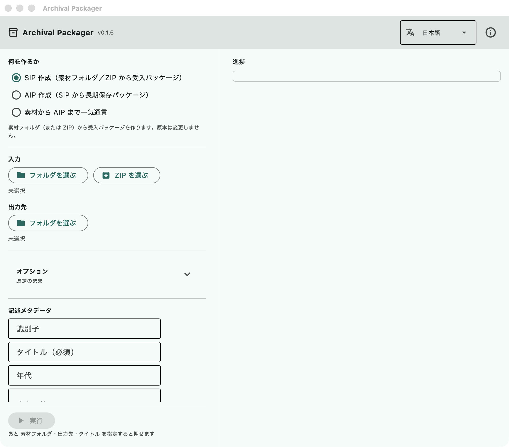

# Usage / 使い方

[English](#english) · [日本語](#日本語)

## English

This is the operator's manual: how to install the application, how to use it
from its window, and how to use it from the command line.

**Read [Known limits](../README.md#known-limits) before you rely on it.** The
short version is at the end of this section.

### Installing

| Platform | Where | Notes |
| --- | --- | --- |
| Windows 10/11 | [Microsoft Store](https://apps.microsoft.com/detail/9N6XJD7THHPZ) | Installs and updates like any other Store application |
| macOS 12+ | [Releases](https://github.com/nakamura196/archival-packager/releases/latest) | A signed and notarised `.dmg`. Drag the application into Applications |

Nothing else has to be installed. Siegfried (format identification) and ClamAV
(virus scanning) are bundled.

**The first launch takes a few minutes** and the window may appear to do
nothing. The Python runtime inside the application (about 100 MB) is being
unpacked. Later launches are quick.

macOS may say the application cannot be opened because the developer cannot be
verified. It is signed with a Developer ID and notarised by Apple, so this
normally does not happen; if it does, open it once from the right-click menu
("Open") rather than by double-clicking.

### Switching the interface to English

The window opens in the language your operating system is set to. Japanese
for a Japanese system, **English for everything else** — German, Korean and
so on get English rather than Japanese, because the source language of the
code is not a reason to show someone a screen they cannot read.

The language selector is at the **top right of the window**, next to the
version number. It is placed in the header on purpose: someone who reads only
English should not have to find it inside a Japanese screen. Once you choose
a language it is remembered, and it always beats the system setting — so an
English interface on a Japanese machine is a choice you can make and keep.

**The interface is translated. The packages are not.** Column headings in the
CSV files, the text of `report.txt`, and the PREMIS event records are written
in Japanese whatever the interface language is. This is deliberate: an
information package is meant to last decades, and `core/sip_reader.py` reads
those headings back. If the headings changed with the interface language, a SIP
made in English could not be read by an application set to Japanese, and the
other way round.

So a non-Japanese reader gets an English interface over packages whose
spreadsheets and reports are in Japanese. Translating the package contents is
open work — see [issue #11](https://github.com/nakamura196/archival-packager/issues/11).

### Using the window


*The window as it opens (macOS, v0.1.6). Windows looks the same apart from the
window frame.*

#### 1. Choose what to create

Three choices at the top:

| Choice | What it does |
| --- | --- |
| Create a SIP | Builds a **submission package** from a folder (or ZIP) of source material |
| Create an AIP | Builds a **preservation package** from a SIP that already exists |
| From source material through to an AIP | Does both, one after the other |

Normally you accession with "Create a SIP", check what it found, and only then
go on to the AIP. They are separate steps because **there are things a person
has to look at while the material is still a SIP**: personal information
candidates, files whose extension disagrees with their content, and files whose
format could not be identified.

#### 2. Choose the input and the destination

- **Input** — the folder holding the material to accession. A ZIP can be given instead.
- **Destination** — where the package is written. Keep it outside the input folder.

The input folder is **only read**. Nothing is ever written into it.

#### 3. Choose the options

"Options" is collapsed when the window opens, and the line under it says which
options are on ("Defaults" when none are).

| Option | What changes |
| --- | --- |
| Wrap the output as a BagIt bag | Writes the SIP as a BagIt bag (`bagit.txt` and `manifest-sha256.txt`) |
| Scan for personally identifiable information (PII) | Looks for email addresses, phone numbers, Japanese individual numbers, card numbers and Japanese postal codes, and lists candidates in `pii-report.csv` |
| Run a virus scan | Scans with the bundled ClamAV. **The definition database has to be downloaded first** (below) |
| Sanitize file names | Repairs characters that cannot be used and names that are too long. The original names are kept in `accession.csv` |
| Serialize the output as a ZIP | Packs the finished package into an uncompressed ZIP, for handing over |
| Normalize to preservation formats (AIP) | Converts images to TIFF and PostScript/EPS to PDF while building the AIP |

The PII scan recognises **five categories, all defined around Japanese
conventions** — Japanese individual numbers (マイナンバー) and Japanese postal
codes in particular. Email addresses and card numbers are not
Japan-specific; phone numbers assume Japanese digit counts. Measured precision
and recall are in [docs/pii-accuracy.md](pii-accuracy.md).

#### 4. Enter the descriptive metadata

- **Identifier** — the identifier of the transfer (e.g. `2026-transfer-general-affairs`). It becomes the folder name.
- **Title** — required. The name of the body of material.

"Dates", "Scope and content" and "Archivist" are optional. The archivist's name
is recorded in the AIP's PREMIS events as the agent that performed the work.

What you enter here is written into the package as the accession record.

#### 5. Run it, and read what it says

"Run" shows progress, then the location of the finished package and a list
headed **"Points to check by eye"**. Four kinds appear there:

- `ウイルス検出:` — a file the virus scanner flagged, with the signature name
- `PII候補:` — a file holding something that looks like personal information, and how many
- `未識別:` — a file whose format could not be identified
- `拡張子不一致:` — a file whose extension disagrees with its actual format

These lines keep their Japanese prefixes, for the reason given above: they come
from `core/`, which does not go through the translation table.

**None of these are acted on automatically.** What to do about them is a
person's decision.

#### 6. Look inside

"Look inside" shows the package as tables. What you can see **only here** is
the content of the METS and the PREMIS records — the XML is not readable as it
stands.

1. **Overview** — what is in it, how many, when it was made
2. **Preservation events** — when, what, with which tool, and with what outcome
3. **Workflow** — the same events grouped by stage (ingestion → virus scan →
   format identification → normalization → validation → checksum → fixity
   check). Select a stage to see the tools used, the counts and any files with
   problems. A stage with no records is shown as such, not hidden
4. **Files** — format, PRONOM identifier, size, SHA-256, virus scan result

The originals themselves (a PDF, a Word file) do not open in the application.
Open the folder and use whatever you normally use.

#### 7. Build the AIP

Once the SIP has been checked, switch to "Create an AIP" and give it **the SIP
folder** as the input. Building an AIP does three things:

- compares the SIP's manifest against the files on disk, to confirm nothing has changed since accession
- normalizes to preservation formats, if you asked for it
- writes a METS with PREMIS events embedded, and wraps the whole thing as a BagIt bag

Derivatives produced by normalization are **opened again and read back** —
a TIFF is fully decoded with Pillow, a PDF is re-opened with pypdf and must
report at least one page. A derivative that cannot be read back is discarded,
and the event is recorded as a failure. This is not format validation: opening
a file says nothing about whether it conforms to its specification.

### The virus definition database

**The definitions are not bundled.** They are several hundred megabytes and
change daily, so bundling them would mean shipping something stale from the
first day.

- In the window: the "Download / update definitions" button
- From the command line: `archival-packager check` prints where they go

If `--virus-scan` is asked for and no definitions are present, **no scan is
run**, and the report says "skipped (no definition database)". It never says
"nothing found". Not having checked must not be mistaken for having found
nothing.

### What it cannot do

Read these before relying on the output:

- [Known limits](../README.md#known-limits) — the range of normalization, the absence of format validation, and the rest
- [docs/pii-accuracy.md](pii-accuracy.md) — the personal information scan covers five categories; measured misses and false positives
- [docs/interoperability.md](interoperability.md) — the comparison with AtoM and Archivematica is **against their specifications**, not yet against running instances
- [docs/rules.md](rules.md) — how to add your own normalization rules
- [docs/performance.md](performance.md) — time and memory from 100 to 50,000 files

### The command line

**The command line is for people running from source.** Arguments do not reach
the packaged builds (`.app` / MSIX) — they arrive as `argv=['']` — so the
downloadable application is window-only by design. If you installed from the
Microsoft Store or from a `.dmg`, use the window.

```sh
uv sync
uv run archival-packager check
uv run archival-packager sip --input ./incoming --output ./packages --identifier 2026-transfer-001 --title "General affairs records"
uv run archival-packager aip --sip ./packages/2026-transfer-001 --output ./preservation
uv run archival-packager inspect ./preservation/2026-transfer-001-AIP
```

Progress goes to standard error, results to standard output; with `--json` the
standard output is a single JSON document, so it pipes into `jq`. Exit codes
are 0 success, 1 failure, 2 wrong arguments. **A virus detection or a personal
information candidate does not make the run fail** — a person decides what to
do about it — but it is always written to standard error and to the JSON.

The Japanese sections below cover the same ground in more detail, including the
full option list and the layout of what gets written.

---

## 日本語

このアプリの使い方を、**画面**と**コマンドライン**の両方について書いています。
できないことは [README の「既知の限界」](../README.md#既知の限界)にまとめてあります。
**使う前に一度そちらを読んでください。**

### コマンドラインは「ソースから動かす人」向けです

配布版（Microsoft Store の版、`.dmg` の版）には、起動時の引数が届きません。
実測で `argv=['']` になります。これは Flet が包んだアプリの制約で、こちらでは
直せません。**配布版をお使いの方は「画面での使い方」だけをご覧ください。**

コマンドラインは、リポジトリを clone して `uv` で動かす場合に使えます。

---

## 導入と初回起動

| OS | 入手先 | 備考 |
| --- | --- | --- |
| Windows 10/11 | [Microsoft Store](https://apps.microsoft.com/detail/9N6XJD7THHPZ) | ふつうのストアアプリと同じで、更新も自動です |
| macOS 12 以降 | [Releases](https://github.com/nakamura196/archival-packager/releases/latest) | 署名・公証済みの `.dmg`。アプリケーションフォルダへドラッグしてください |

ほかに入れるものはありません。フォーマットの識別（Siegfried）とウイルス検査
（ClamAV）に使う道具は同梱しています。

**初回の起動には数分かかります。** 窓が出たまま何も起きないように見えますが、
アプリの中に入っている Python（約 100 MB）を展開しています。2 回目以降は
すぐ立ち上がります。

macOS で「開発元を確認できないため開けません」と出た場合は、右クリックから
「開く」を選んでください。署名と公証はしてあるので通常は出ませんが、
ダウンロードの経路によっては出ることがあります。

**最初にやること**は、ウイルス検査を使う場合の定義データベースの取得です
（数百 MB あります）。「ウイルス定義データベース」の「定義を取得 / 更新」から
行ってください。詳しくは後述します。

### 画面の言語を切り替える

**初回の起動では、OS の言語に合わせて開きます。** 日本語の環境なら日本語、
**それ以外はすべて英語**です（ドイツ語や韓国語の環境でも英語になります。
原文が日本語なのはこちらの都合であって、読めない画面を出す理由にはなりません）。

言語の選択は**窓の右上**、版番号の隣にあります。日本語と英語です。
一度選ぶと次回以降も引き継がれ、**OS の設定より優先されます**。
日本語の環境で英語の画面を使うこともできます。

**訳されるのは画面だけで、パッケージの中身は訳されません。** CSV の見出し、
`report.txt` の本文、PREMIS の記録は、画面の言語にかかわらず日本語で書かれます。
情報パッケージは何十年も残る前提のもので、`core/sip_reader.py` は日本語の
見出しで CSV を読み戻します。見出しが画面の言語で変わると、英語で作った SIP を
日本語のアプリが読めなくなります。

---

## 画面での使い方



*起動した直後の画面（macOS、v0.1.6）。Windows も窓枠が違うだけで同じです。*

### 1. 何を作るか選ぶ

起動すると、上に 3 つの選択肢があります。

| 選択肢 | 何をするか |
| --- | --- |
| SIP 作成 | 素材のフォルダ（または ZIP）から**受入パッケージ**を作る |
| AIP 作成 | できている SIP から**長期保存パッケージ**を作る |
| 素材から AIP まで一気通貫 | 上の 2 つを続けて行う |

ふだんは「SIP 作成」で受け入れ、中身を確かめてから「AIP 作成」に進みます。
分けているのは、**SIP の段階で人が確かめることがある**ためです
（個人情報の候補、拡張子と中身の食い違い、未識別のファイル）。

### 2. フォルダを指定する

- **素材フォルダ**: 受け入れる資料の入ったフォルダ。ZIP を選ぶこともできます
- **出力先**: パッケージを書き出すフォルダ。素材フォルダとは別にしてください
  （素材フォルダやその中を選ぶと、赤字で知らせ、実行できないようにしてあります）

素材フォルダの中身は**読むだけ**です。原本には一切書き込みません。

### 3. オプションを選ぶ

「オプション」は起動時は畳んであります。見出しの下の行に、いま効いている
ものが並びます（何も選んでいなければ「既定のまま」）。

| オプション | 何が変わるか |
| --- | --- |
| BagIt bag として梱包する | SIP を BagIt の形（`bagit.txt` と `manifest-sha256.txt` を持つ形）にする |
| 個人情報(PII)を走査する | メール・電話・マイナンバー・カード番号・郵便番号の候補を探し、`pii-report.csv` に出す |
| ウイルス検査を行う | 同梱の ClamAV で検査する。**定義データベースが要ります**（後述） |
| ファイル名を安全化する | 使えない文字や長すぎる名前を直す。元の名前は `accession.csv` に残る |
| 成果物を ZIP に固める | できたパッケージを無圧縮の ZIP にする（受け渡し用） |
| 保存用フォーマットへ変換する | AIP で画像を TIFF に、PostScript/EPS を PDF にする |

### 4. 記述メタデータを入れる

- **識別子**: 移管の識別子（例: `2026-移管-総務課`）。フォルダ名になります
- **タイトル**: 必須。資料のまとまりの名前

「年代」「内容・範囲」「担当者名」は任意です。担当者名は AIP の処理記録
（PREMIS）に、作業を行った人として残ります。

ここで入れた内容が、受入記録としてパッケージに残ります。

### 5. 実行して、結果を見る

「実行」を押すと進捗が流れます。終わると、できたパッケージの場所と、
**目視確認が必要な点**が並びます。ここに出るのは次の 4 種類です。

- `ウイルス検出:` — 検出されたファイルとシグネチャ名
- `PII候補:` — 個人情報らしき記述のあるファイルと件数
- `未識別:` — フォーマットを特定できなかったファイル
- `拡張子不一致:` — 拡張子と中身の形式が食い違っているファイル

**どれも自動では消しません。** 取り扱いは人が決めることだからです。

### 6. 中身を確認する

「中身を見る」を押すと、パッケージの中身を表にして見せます。ここでしか
見られないのは **METS と PREMIS の中身**です（XML を開いても読めないため）。

1. 概要 — 何がいくつ入っているか、いつ作ったか
2. 処理の記録 — いつ・何を・どの道具で行い、結果はどうだったか
3. ワークフロー — 同じ記録を段階ごとにまとめた流れ図（取り込み → ウイルス検査 →
   識別 → 変換 → 検証 → チェックサム → 完全性の確認）。段階を押すと、使った
   道具・件数・問題のあったファイルが出ます。記録の無い段階も「記録なし」として残します
4. ファイル一覧 — フォーマット・PRONOM ID・サイズ・SHA-256・ウイルス検査

原本そのもの（PDF や Word）はアプリでは開けません。フォルダを開いて、
いつものアプリでご覧ください。

### 7. AIP を作る

SIP を確かめたら「AIP 作成」に切り替え、**SIP のフォルダ**を入力に指定します。
SIP を作った直後なら、結果の下の「この SIP から AIP を作る」を押すと、この 2 つを一度に行います。
SIP でないフォルダ（素材のフォルダや、SIP を入れた出力先のフォルダ）を選ぶと、
入力の下に赤字で知らせます。
AIP を作るとき、アプリは次のことを行います。

- SIP のマニフェストと実ファイルを突き合わせ、受入時から変わっていないか確かめる
- 保存用フォーマットへの変換（オプション）
- 処理の記録（PREMIS）を埋め込んだ METS を作り、BagIt bag に固める

---

## コマンドラインの使い方

### 準備

```sh
git clone https://github.com/nakamura196/archival-packager.git
cd archival-packager
uv sync
uv run archival-packager check
```

`check` は、同梱の道具（フォーマット識別・ウイルス検査）とウイルス定義の状態、
変換規則表の状態を表示します。**何が使えないかを先に確かめるためのもの**なので、
道具が無くても失敗にはなりません。

同梱の道具はリポジトリには入っていません。必要なら次で取得します
（macOS は `scripts/fetch-binaries.zsh`、Windows は `scripts/fetch-binaries.ps1`）。
道具が無い場合、フォーマット識別とウイルス検査は**行わずにスキップ**され、
その旨がレポートに残ります（「検査していない」が「問題なし」に化けないようにするため）。

### コマンド

```
archival-packager sip --input DIR --output DIR --identifier ID --title TITLE
                      [--scope-note TEXT] [--date-note TEXT]
                      [--bag] [--scan-pii] [--virus-scan]
                      [--sanitize-filenames] [--zip] [--prior-accession CSV]
                      [--json] [--quiet]

archival-packager aip --sip DIR --output DIR
                      [--no-normalize] [--archivist NAME] [--zip]
                      [--json] [--quiet]

archival-packager inspect PACKAGE_DIR [--json]

archival-packager check [--json]
```

画面にある「一気通貫」に当たるコマンドはありません。`sip` の次に `aip` を
呼んでください（途中で人が確認する余地を残すため、分けたままにしています）。

#### `sip` — 受入パッケージを作る

| オプション | 意味 |
| --- | --- |
| `--input DIR` | 素材のフォルダ、または ZIP ファイル |
| `--output DIR` | 書き出し先。無ければ 1 段だけ作ります |
| `--identifier ID` | 移管の識別子。パッケージのフォルダ名になります |
| `--title TITLE` | タイトル（必須） |
| `--scope-note` / `--date-note` | 内容・範囲 / 年代（任意） |
| `--bag` | BagIt bag として梱包する |
| `--scan-pii` | 個人情報の候補を走査する |
| `--virus-scan` | ウイルス検査を行う（定義データベースが要ります） |
| `--sanitize-filenames` | ファイル名を安全化する（元名は `accession.csv` に残ります） |
| `--zip` | できた SIP を無圧縮 ZIP に固める |
| `--prior-accession CSV` | 前回の `accession.csv`。配列前後の対応表を出します |

```sh
uv run archival-packager sip --input ./受入/2026-03 --output ./パッケージ --identifier 2026-移管-総務課 --title 総務課文書 --scan-pii
```

#### `aip` — 長期保存パッケージを作る

| オプション | 意味 |
| --- | --- |
| `--sip DIR` | 入力の SIP（bag でも可） |
| `--output DIR` | 書き出し先 |
| `--no-normalize` | 保存用フォーマットへの変換を行わない |
| `--archivist NAME` | 担当者名。PREMIS に実施者として残します |
| `--zip` | できた AIP を無圧縮 ZIP に固める |

```sh
uv run archival-packager aip --sip ./パッケージ/2026-移管-総務課 --output ./保存 --archivist "中村 覚"
```

#### `inspect` — 中身を表示する

画面の「中身を見る」と同じものを文字で出します。`--json` を付けると
ファイル一覧まで全件出ます（文字での表示は先頭 20 件までです）。

```sh
uv run archival-packager inspect ./保存/2026-移管-総務課-AIP
uv run archival-packager inspect ./保存/2026-移管-総務課-AIP --json | jq '.summary'
```

### 出力の約束（自動化するときはここが要点）

- **進捗は標準エラー、結果は標準出力**に出ます
- `--json` のとき、標準出力は **JSON 1 個だけ**です。そのまま `jq` に繋げます
- `--quiet` は進捗を止めます。**結果と検出の知らせは止まりません**
- 失敗したときも `--json` なら `{"status": "error", "message": "..."}` が返ります

終了コードは次のとおりです。

| コード | 意味 |
| --- | --- |
| 0 | 成功 |
| 1 | 処理の失敗（入力が SIP でなかった、書き出せなかった など） |
| 2 | 引数の誤り（足りない、綴りが違う、指定されたパスが無い） |

**ウイルスの検出と個人情報の候補では 0 のままです。** 検出は人が判断する材料で
あって、処理としては成功しています。ここを失敗にすると、毎晩の自動処理が
「止めるべき失敗」と「見てほしい所見」を区別できなくなります。見落とされないよう、
検出は必ず標準エラーと `--json` の `findings` に出ます。

AIP を作るときの**完全性の確認（マニフェスト照合）が不一致でも 0 です**。
AIP は作成され、不一致は PREMIS に記録されます。自動処理で捕まえたい場合は
`--json` の `.fixity.outcome` を見てください（`passed` / `failed` / `skipped`）。

### 自動化の例

#### 毎晩フォルダを見て SIP を作る（cron + zsh）

3 行を超える処理は端末に貼らず、スクリプトにします
（貼り付け事故を構造的に防げます）。`scripts/nightly-sip.zsh` として置く例:

```zsh
#!/usr/bin/env zsh
# 受入フォルダにその日の資料があれば SIP を作る。cron から毎晩呼ぶ。
# 使い方: nightly-sip.zsh
# 前提: リポジトリを clone し uv sync 済みであること。
set -euo pipefail

REPO=$HOME/archival-packager
INBOX=/Volumes/transfer/incoming
OUTBOX=/Volumes/transfer/packages
TODAY=$(date +%Y-%m-%d)

if [[ ! -d $INBOX/$TODAY ]]; then print "受入なし: $TODAY"; exit 0; fi

cd $REPO
uv run archival-packager sip --input $INBOX/$TODAY --output $OUTBOX --identifier $TODAY --title "日次受入 $TODAY" --scan-pii --virus-scan --bag --json --quiet > $OUTBOX/$TODAY.json

print "SIP: $(python3 -c 'import json,sys; print(json.load(open(sys.argv[1]))["sip_path"])' $OUTBOX/$TODAY.json)"
```

cron への登録（毎晩 2 時）:

```
0 2 * * * /Users/archivist/archival-packager/scripts/nightly-sip.zsh >> /var/log/archival-packager.log 2>&1
```

進捗も記録に残したいので、`2>&1` でまとめています。`--quiet` を外すと
進捗の 1 行ずつがログに入ります。

検出があった日に気づけるようにするなら、JSON を見て知らせます。

```zsh
VIRUS=$(python3 -c 'import json,sys; print(len(json.load(open(sys.argv[1]))["findings"]["virus"]))' $OUTBOX/$TODAY.json)
if [[ $VIRUS -gt 0 ]]; then print "要確認: ウイルス $VIRUS 件"; fi
```

#### CI で退行を見張る（GitHub Actions）

小さな素材から SIP を作り、**出来上がりが変わっていないか**を見ます。

```yaml
- run: uv sync
- run: uv run archival-packager check
- run: mkdir -p sample && printf 'test\n' > sample/a.txt
- run: uv run archival-packager sip --input sample --output ${{ runner.temp }}/out --identifier ci --title CI --json --quiet > ${{ runner.temp }}/sip.json
- run: uv run archival-packager inspect ${{ runner.temp }}/out/ci --json | jq -e '.overview.file_count == 1'
```

`sample` は、いつも同じ結果になる小さな素材のフォルダです。リポジトリに
置いておくか、上のようにその場で作ります。

`jq -e` は条件が偽なら終了コードを 1 にするので、そのままジョブが赤くなります。
`.summary.unidentified` のような値も同じように見張れますが、**同梱ツールを置いていない CI では
フォーマット識別が行われず全件が未識別になります**。何を見張るかは、その環境で
`check` が何を「あり」と言うかに合わせてください。
`uv run pytest -q` も併せて回してください（このアプリ自身の退行はそちらが見ています）。

---

## 出力に何が入るか

### SIP

```
<識別子>/
  objects/                      原本のコピー（フォルダ構成はそのまま）
  metadata/
    metadata.csv                Archivematica 風の記述シート（人が書き込む）
    checksum.sha256             objects/ からの相対パスで SHA-256
    submissionDocumentation/
      description.csv           AtoM / ISAD(G) の記述シート（人が書き込む）
      atom-import.csv           AtoM に読ませる用（機械名の列）
      formats.csv               技術インベントリ（形式・PRONOM・サイズ・SHA-256・ウイルス検査）
      accession.csv             受入記録（元のファイル名・パス）
      dfxml.xml                 技術メタデータ（DFXML）
      report.txt / report.html  人が読むまとめ
      checksum.sha256           SIP ルートからの相対パスで SHA-256
      pii-report.csv            個人情報の候補（--scan-pii のときだけ）
      arrangement-map.csv       配列前後の対応表（--prior-accession のときだけ）
```

`--bag` を付けた場合は、上の全体が `data/` の下に入り、`bagit.txt` と
`manifest-sha256.txt` が付きます。

**人が書き込むのは `description.csv` と `metadata.csv` の 2 つ**です。
`metadata.csv` に書いた内容は、AIP を作るときにファイル単位の記述として
METS に入ります。

### AIP

```
<識別子>-AIP/
  bagit.txt / bag-info.txt / manifest-sha256.txt / tagmanifest-sha256.txt
  data/
    METS.<uuid>.xml             PREMIS を埋め込んだ METS（処理の記録はここ）
    objects/                    原本。変換した場合は保存用の派生物も
    objects/submissionDocumentation/
                                SIP 段の提出書類と、実際に効いた変換規則表
    logs/                       保存処理のログ
```

METS の中身は `inspect` か画面の「中身を見る」で読めます。

### `dfxml.xml` に入る画像の情報

画像ファイルについては、DFXML の `fileobject` に `ap:image` という要素を足して、
**画素数・色空間・1 サンプルあたりのビット数・DPI** を記録します。
実際に読み取れた値だけを書き、推定はしません（DPI が無ければ書きません）。

`ap:` はこのアプリ独自の名前空間です。DFXML の要素は増やしも並べ替えもしていません
（DFXML のスキーマが `fileobject` の末尾に他名前空間の要素を許しているので、そこに置いています）。
読み取りに使った Pillow の版も `creator` に残します。

画像が開けなかった場合は `ap:image readable="false"` と理由を書き、
警告にも出します。**開けたかどうかを書かずに黙って省く、ということはしません。**

対象は変換規則表で Pillow を使うことになっている形式と TIFF です。
規則表に PUID を足せば、そこも自動で対象になります。音声・動画は対象外です
（別のライブラリが要るため）。

---

## ウイルス定義データベースについて

**定義データベースはアプリに入っていません。** 数百 MB あり、日々更新されるため、
同梱すると配った瞬間から古くなります。別途取得してください。

- 画面: 「定義を取得 / 更新」ボタン
- 置き場所は `archival-packager check` が表示します

定義が無い状態で `--virus-scan` を付けても、検査は**行われず**、
レポートには「スキップ（定義 DB 未取得）」と残ります。**「検出なし」とは書きません。**
検査していないことを、問題が無かったことと取り違えないためです。

---

## できないこと

使う前に読んでください。

- [README「既知の限界」](../README.md#既知の限界) — 変換の範囲、検証機能が無いこと、ほか
- [docs/pii-accuracy.md](pii-accuracy.md) — 個人情報の検出は 5 種別だけ。実測した見落としと誤検出
- [docs/interoperability.md](interoperability.md) — AtoM / Archivematica との突合は**仕様との比較まで**
- [docs/rules.md](rules.md) — 変換規則を自分で足す方法
- [docs/performance.md](performance.md) — 100 〜 5 万件での所要時間とメモリ
